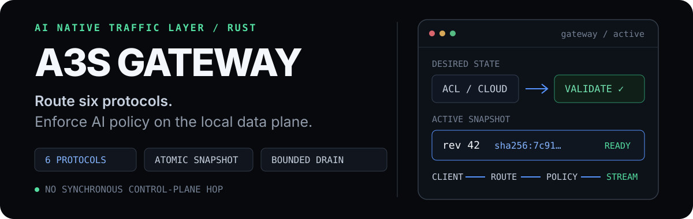
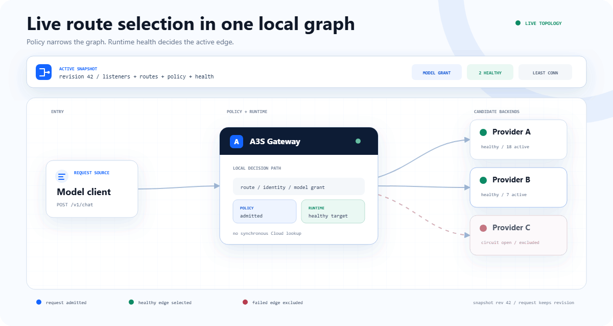
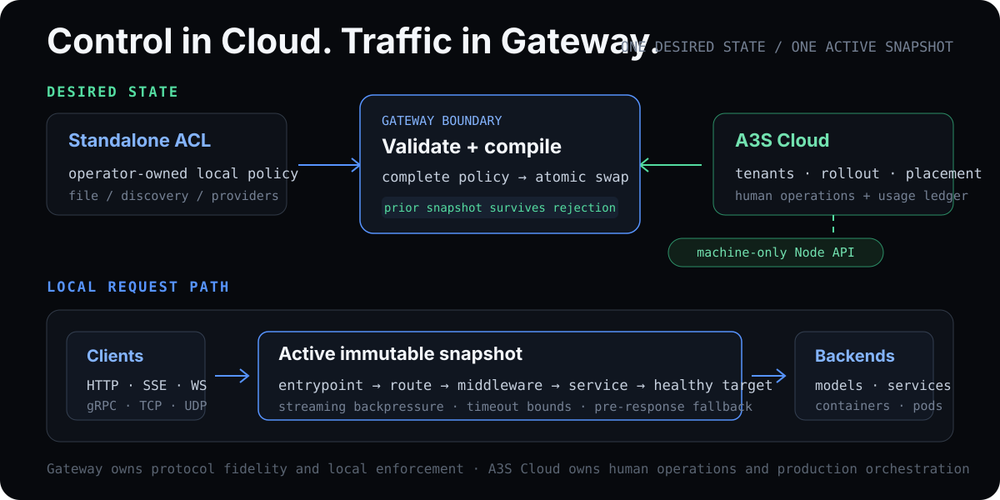

<p align="center">
  
</p>

<p align="center">
  <strong>AI Native Traffic Layer — protocol routing, streaming, and local policy enforcement in Rust.</strong>
</p>

<p align="center">
  <a href="https://github.com/A3S-Lab/Gateway/actions/workflows/ci.yml"></a>
  <a href="https://github.com/A3S-Lab/Gateway/releases/latest"></a>
  <a href="https://crates.io/crates/a3s-gateway"></a>
  <a href="https://www.rust-lang.org/"></a>
  <a href="LICENSE"></a>
</p>

<p align="center">
  <a href="https://a3s-lab.github.io/Gateway/">Website</a> &middot;
  <a href="https://a3s-lab.github.io/Gateway/docs/">Documentation</a> &middot;
  <a href="#quick-start">Quick start</a> &middot;
  <a href="#features">Features</a> &middot;
  <a href="#performance">Performance</a> &middot;
  <a href="ROADMAP.md">Roadmap</a>
</p>

---

A3S Gateway routes HTTP, SSE, WebSocket, gRPC, TCP, and UDP traffic through
one validated runtime snapshot. It applies authentication, admission limits,
model grants, backend health, balancing, retry, and streaming bounds before
relaying traffic to an allowed healthy target.

Run from local ACL in `standalone` mode or consume complete desired
state from A3S Cloud in `cloud-managed` mode. Request decisions remain local;
A3S Cloud owns deployment, tenants, rollout, managed replicas, and the
long-term usage ledger.

<p align="center">
  
</p>

<p align="center">
  <sub><a href="website/assets/request-path-demo.svg">Static request-path diagram</a></sub>
</p>

## Quick start

Install on macOS or Linux:

```bash
curl --proto '=https' --tlsv1.2 -LsSf https://a3s-lab.github.io/Gateway/install.sh | sh
```

Install on Windows PowerShell:

```powershell
[Net.ServicePointManager]::SecurityProtocol = [Net.ServicePointManager]::SecurityProtocol -bor [Net.SecurityProtocolType]::Tls12; irm https://a3s-lab.github.io/Gateway/install.ps1 | iex
```

Cargo and Homebrew are also supported:

```bash
cargo install a3s-gateway
# or
brew install a3s-lab/tap/a3s-gateway
```

With an HTTP backend listening on `127.0.0.1:8000`, save this as
`gateway.acl`:

```acl
mode { kind = "standalone" }

entrypoints "web" {
  address = "127.0.0.1:8080"
}

routers "models" {
  rule        = "PathPrefix(`/v1`)"
  service     = "models"
  entrypoints = ["web"]
  middlewares = ["rate-limit"]
}

middlewares "rate-limit" {
  type  = "rate-limit"
  rate  = 60
  burst = 10
}

services "models" {
  load_balancer {
    strategy             = "least-connections"
    request_timeout      = "30s"
    stream_idle_timeout  = "5m"
    stream_total_timeout = "60m"
    servers = [{ url = "http://127.0.0.1:8000" }]

    health_check {
      path                 = "/health"
      interval             = "10s"
      timeout              = "5s"
      unhealthy_threshold = 3
      healthy_threshold   = 1
    }
  }
}
```

Validate, inspect, start, and send a request:

```bash
a3s-gateway validate --config gateway.acl
a3s-gateway config --config gateway.acl summary
a3s-gateway --config gateway.acl
curl http://127.0.0.1:8080/v1/models
```

## Feature status

Status is explicit: **Available** is shipped in the Gateway data plane,
**Gateway foundation** needs joint A3S Cloud work for the complete product
workflow, and **Experimental** remains opt-in.

| Area | Status | Current capability |
| --- | --- | --- |
| Protocol and streaming plane | Available | HTTP/1.1, HTTP/2, SSE, WebSocket, native gRPC over h2c, TCP, UDP, TLS termination, certificate-verified HTTP/HTTPS upstreams, full-duplex relay, trailers, backpressure, independent stream bounds, and bounded drain |
| Routing | Available | Host, path, method, header, and SNI rules; explicit priority; static revision weights; request mirroring |
| Balancing and health | Available | Round-robin, weighted, least-connections, random, active/passive health, circuit state, sticky sessions, failover, and pre-response fallback |
| Middleware | Available | API key, Basic Auth, JWT, forward auth, local/Redis rate limits, retry, circuit breaker, CORS, headers, prefix stripping, body limits, compression, IP allowlists, TCP filtering, and typed Rust extensions |
| Configuration lifecycle | Available | Standalone ACL and Cloud-managed modes, fail-closed validation, serialized listener reconciliation, atomic snapshot activation, prior-runtime retention, exact readiness, and optional durable managed-state recovery |
| Managed OpenAI paths | Gateway foundation | Models, chat completions, completions, embeddings, local grants, RPM/burst/concurrency admission, model rewriting, request/attempt identity, health-aware targets, and pre-response fallback |
| Observability | Available | Terminal JSON access logs, W3C/B3 trace intake, W3C propagation, Prometheus metrics, service latency/TTFT/pressure signals, and bounded labels |
| Usage spool | Gateway foundation | Prompt-free request/attempt lifecycle records, integrity checks, bounded capacity, restart recovery, ordered replay, contiguous acknowledgement, reclamation, and compaction |
| Machine Node API | Available | Bounded health, readiness, metrics, version, snapshot apply, and usage acknowledgement endpoints; no human administration UI |
| Providers and delivery | Available | File watcher, HTTP discovery, Docker labels, optional Kubernetes Ingress integration, checksum-verified installers, release archives, Cargo, Homebrew, Docker, and Helm |
| Standalone autoscaling | Experimental | Local and Kubernetes Scale adapters exist, isolated from Cloud-managed mode; real-cluster and executor recovery conformance remain open |
| Automatic gradual rollout | Not available | `rollout {}` is rejected. Standalone mode can use explicit static revision weights; managed rollout decisions belong to A3S Cloud |

AI model traffic commonly combines long-lived responses, expensive backends,
identity-bound model access, and configuration supplied by a remote control
plane. Gateway keeps these controls in the local data plane:

| Traffic requirement | Gateway mechanism |
| --- | --- |
| Long-lived responses | Separate first-response, idle-stream, and total-operation bounds |
| Uneven backend failure | Active/passive health, circuit state, failover, and pre-response retry |
| Safe policy changes | Complete validation followed by an atomic snapshot swap |
| Model-specific access | Endpoint/model grants, rewriting, RPM, burst, and concurrency admission |
| Remote desired state | Complete Cloud snapshots executed without a synchronous control-plane call |

### Planned work

| Track | Status | Remaining outcome |
| --- | --- | --- |
| Managed target delivery (`H0.2`) | Joint verification | Prove process-loss recovery, redelivery, stale/digest/expiry rejection, certificate replacement, and mixed Gateway versions with A3S Cloud |
| Inference authorization (`I0.2b`) | Planned | Add trusted token accounting, grant budgets and reconciliation, the matching Cloud policy compiler, and joint expiry/revocation/fallback conformance |
| Usage delivery (`I0.2c`) | Planned | Freeze the authenticated batch/contiguous-ACK contract, connect the production uploader, reconcile gaps, and ingest into the Cloud ledger |
| Production topology (`H0.3`–`H0.5`) | Planned | Bind target identity to applied generations and prove removal, drain, rolling replacement, node loss, revision skew, and degraded readiness across replicas |
| Standalone scaling | Experimental validation | Validate Kubernetes Scale against a real cluster, close the Box Scale recovery contract, and add versioned idempotency |
| Performance evidence | Planned evidence | Profile scheduler and upstream-pool costs on dedicated hardware, add payload/upstream/connection/long-stream variants, and set regression thresholds only after stable runs |
| Native MCP or remote Agent traffic (`A0` / `C0`) | Contract first | Define identity, authorization, affinity, resumption, cancellation, drain, discovery, bounds, telemetry, and mixed-version recovery before implementation; A2A has no committed milestone |

Operator UI, tenants, credentials, deployment, placement, managed rollout, audit
views, long-term usage storage, and billing remain A3S Cloud responsibilities.
See the [complete roadmap and definition of done](ROADMAP.md).

## Middleware extensions

ACL middleware runs in listed order on requests and unwinds in reverse order
on responses. Embedded deployments can register application-specific Rust
middleware under a stable router-facing name:

```rust
use a3s_gateway::{Gateway, Middleware, MiddlewareRegistry, RequestContext, Result};
use a3s_gateway::config::GatewayConfig;
use async_trait::async_trait;
use http::{request::Parts, HeaderValue, Response};

struct TenantPolicy;

#[async_trait]
impl Middleware for TenantPolicy {
    async fn handle_request(
        &self,
        request: &mut Parts,
        _context: &RequestContext,
    ) -> Result<Option<Response<Vec<u8>>>> {
        request.headers.insert(
            "x-policy-source",
            HeaderValue::from_static("tenant-policy"),
        );
        Ok(None)
    }

    fn name(&self) -> &str {
        "tenant-policy"
    }
}

fn build_gateway(config: GatewayConfig) -> Result<Gateway> {
    let mut registry = MiddlewareRegistry::new();
    registry.register("tenant-policy", TenantPolicy)?;
    Gateway::with_middlewares(config, registry)
}
```

ACL can then reference `middlewares = ["tenant-policy"]`. Registration occurs
before Gateway construction; the standalone binary does not load dynamic
libraries or Wasm plugins. See the [middleware guide](https://a3s-lab.github.io/Gateway/docs/#middleware)
for ordering, built-in configuration, and response hooks.

## Performance

The performance workflow covers every traffic type implemented by the data
plane instead of extrapolating from an HTTP-only result. A3S Gateway and NGINX
run on the same GitHub-hosted runner against shared local fixtures.

When middleware, managed inference, mirroring, sticky sessions, failover,
scaling, and observability are inactive, startup marks the route for a direct
HTTP relay. Ordinary HTTP, finite SSE, and validated standalone OpenAI traffic
share that route-bound, sharded upstream pool. A startup-bound single backend
also skips backend-operation counting because routing, scaling, concurrency,
and telemetry consumers are absent. Feature-bearing routes continue through
the general dispatcher without changing their policy semantics.

The current hot-path pass also collapses already-terminal request bodies,
arms HTTP response timers only after a pending frame, aligns upstream pool
shards with Tokio workers, avoids redundant multi-backend scans, removes gRPC
request-body boxing, coalesces the gRPC response body and timers into one
allocation, and polls WebSocket peers with deterministic alternating priority.
These are allocation and scheduler-cost reductions; the published matrix is
used as no-regression evidence rather than an isolated throughput claim.

| In-process operation | Input | Median | 95% confidence interval |
| --- | ---: | ---: | ---: |
| Highest-priority exact-host match | 1,000 routes | 147.1 ns | 146.9–147.3 ns |
| Unknown exact host | 1,000 routes | 51.6 ns | 51.5–51.6 ns |
| Request middleware pipeline | 10 entries | 965.1 ns | 964.7–965.4 ns |
| Complete ACL parse | 300 services and routes | 4.926 ms | 4.921–4.928 ms |

| Profile | Data path | Unit | Capability alignment |
| --- | --- | --- | --- |
| HTTP/1.1 | Keep-alive, 42-byte JSON | requests/s | Equivalent forwarding |
| HTTPS · HTTP/1.1 | Downstream TLS termination | requests/s | Equivalent forwarding |
| HTTPS · HTTP/2 | 4 connections × 16 streams | requests/s | Equivalent forwarding |
| gRPC unary | HTTP/2 TLS downstream, h2c upstream | requests/s | Equivalent forwarding |
| SSE | Finite three-event response | streams/s | Equivalent streaming |
| WebSocket | 32-byte binary echo | messages/s | Equivalent bidirectional relay |
| TCP | 32-byte echo | round trips/s | Equivalent layer-4 relay |
| UDP | 32-byte datagram echo | round trips/s | Equivalent layer-4 relay |
| OpenAI JSON | Chat Completions request validation | requests/s | A3S feature-on cost vs NGINX transport |
| OpenAI stream | Bounded JSON validation and finite SSE relay | streams/s | A3S feature-on cost vs NGINX transport |

Latest same-host snapshot: commit [`fbb8ae0`](https://github.com/A3S-Lab/Gateway/commit/fbb8ae0ef490ea793f5baf9c205f93f6818f9eb9),
[workflow run `31070380529`](https://github.com/A3S-Lab/Gateway/actions/runs/31070380529).

| Profile | A3S median rate | NGINX median rate | Throughput ratio | P99 latency ratio |
| --- | ---: | ---: | ---: | ---: |
| HTTP/1.1 | 46,606.1 | 58,535.7 | 0.796× | 1.065× |
| HTTPS · HTTP/1.1 | 43,200.9 | 47,747.2 | 0.905× | 1.047× |
| HTTPS · HTTP/2 | 47,731.1 | 26,057.0 | 1.832× | 0.893× |
| gRPC unary | 6,126.2 | 3,075.9 | 1.992× | 1.846× |
| SSE | 46,706.7 | 58,072.9 | 0.804× | 1.050× |
| WebSocket | 70,676.9 | 84,694.2 | 0.834× | 0.531× |
| TCP | 75,791.1 | 83,423.6 | 0.909× | 0.496× |
| UDP | 76,973.8 | 55,332.3 | 1.391× | 0.696× |
| OpenAI JSON | 43,769.3 | 56,528.9 | 0.774× | 1.118× |
| OpenAI stream | 43,815.8 | 56,164.3 | 0.780× | 1.101× |

Every A3S and NGINX trial completed with 100% success. A throughput ratio above
1 means A3S completed more operations in this run; a P99 ratio below 1 means
A3S recorded lower tail latency. This run used the same runner image and AMD
EPYC 9V74 CPU as the immediately preceding [`68c5d2d`](https://github.com/A3S-Lab/Gateway/commit/68c5d2dec39aaa7f1c46d73a7e16d583ba0e6886)
[snapshot](https://github.com/A3S-Lab/Gateway/actions/runs/31069540643). The
WebSocket-only change measured 70,656.9 to 70,676.9 messages/s (+0.03%) and an
A3S/NGINX ratio of 0.8344 to 0.8345. Eight other non-gRPC A3S medians stayed
between -1.2% and -0.4%; the unrelated gRPC row varied by -19% while NGINX
HTTP/2 also varied materially. This is shared-runner regression evidence, not
an isolated speedup claim or a production capacity forecast.

Each profile uses three alternating 10-second trials and reports median
throughput plus average, P50, P90, and P99 latency. HTTP/1.1, TLS, HTTP/2,
gRPC, and SSE use pinned `oha` 1.15.0. The checked-in Rust load generator
measures persistent WebSocket, TCP, and UDP round trips. A difference below
three percent is recorded as within threshold.

[Published matrix](https://a3s-lab.github.io/Gateway/#performance) ·
[Criterion JSON](website/assets/performance-data.json) ·
[Protocol comparison JSON](website/assets/performance-comparison.json) ·
[Methodology](benchmarks/README.md)

## Architecture

<p align="center">
  
</p>

| Mode | Desired-state owner | Gateway responsibility |
| --- | --- | --- |
| `standalone` | Local ACL | Validate and execute local routing, middleware, health, provider, and optional scaling policy |
| `cloud-managed` | A3S Cloud | Validate and execute one complete identity-, revision-, digest-, and expiry-bound traffic snapshot |

Gateway exposes a machine-only Node API for health, metrics, version, managed
snapshot application, and exact snapshot status. Human operations remain in
A3S Cloud. Changing desired-state authority requires a process restart.

## Deploy or embed

Docker:

```bash
docker run --rm \
  -v "$PWD/gateway.acl:/etc/gateway/gateway.acl:ro" \
  -p 8080:8080 \
  ghcr.io/a3s-lab/gateway:latest \
  --config /etc/gateway/gateway.acl
```

Helm:

```bash
helm install gateway deploy/helm/a3s-gateway \
  --set image.repository=ghcr.io/a3s-lab/gateway \
  --set-file config=./gateway.acl
```

Rust library:

```bash
cargo add a3s-gateway
```

Optional Cargo features:

| Feature | Adds |
| --- | --- |
| `redis` | Redis-backed distributed rate limiting |
| `kube` | Kubernetes Ingress provider and Scale executor |
| `wire` | Inline LLM/MCP secret and PII inspection through `a3s-sentry` |

## Development

Rust 1.88 or newer is required.

```bash
cargo fmt --all -- --check
cargo clippy --locked --all-targets -- -D warnings
cargo test --locked
bash scripts/test-install.sh
python website/scripts/check_site.py
node --check website/app.js
node --check website/docs/docs.js
```

## Documentation and license

- [Product website](https://a3s-lab.github.io/Gateway/)
- [Gateway documentation](https://a3s-lab.github.io/Gateway/docs/)
- [Release process](RELEASING.md)
- [Changelog](CHANGELOG.md)
- [Roadmap](ROADMAP.md)

Licensed under the [MIT License](LICENSE).
