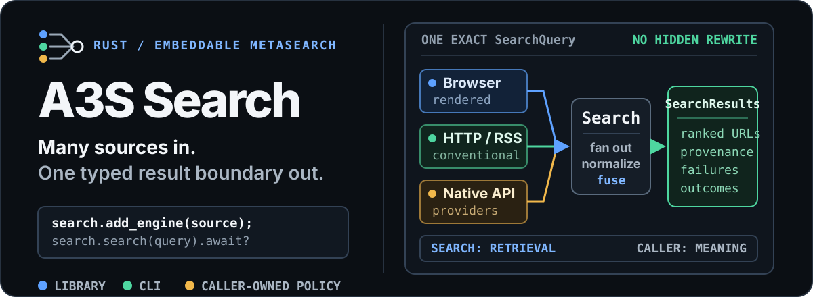
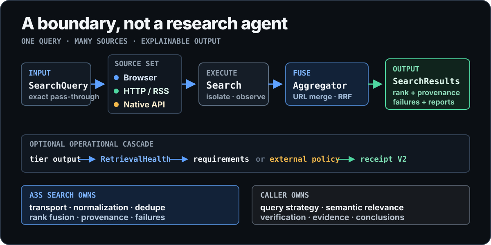

<p align="center">
  
</p>

<p align="center">
  <strong>Many search sources in. One typed, embeddable result boundary out.</strong>
</p>

<p align="center">
  <a href="https://github.com/A3S-Lab/Search/actions/workflows/ci.yml"></a>
  <a href="https://crates.io/crates/a3s-search"></a>
  <a href="https://docs.rs/a3s-search"></a>
  <a href="https://www.rust-lang.org/"></a>
  <a href="./LICENSE"></a>
</p>

<p align="center">
  <a href="#run-one-search">Quick start</a> ·
  <a href="#the-metasearch-boundary">Boundary</a> ·
  <a href="#retrieval-sources">Sources</a> ·
  <a href="#ranking-and-fallback">Ranking</a> ·
  <a href="#extend-the-engine">Extend</a> ·
  <a href="#reliability-without-global-policy">Reliability</a>
</p>

---

A3S Search is a Rust library and companion CLI for composing independent web
search sources. Browser-rendered engines, conventional HTTP/RSS endpoints, and
native search APIs all cross the same `Engine` boundary. The runtime fans work
out concurrently, preserves partial failures, normalizes and deduplicates URLs,
fuses source ranks, and returns one structured `SearchResults` container.

> [!IMPORTANT]
> A3S Search is a retrieval kernel, not a research agent. It does not rewrite
> queries, judge document meaning, verify claims, or write reports. Callers such
> as DeepResearch own query planning, semantic evaluation, corroboration, and
> conclusions.

## Run one search

### From the CLI

Install the latest published command:

```bash
cargo install a3s-search

# macOS or Linux through the A3S Homebrew tap
brew install A3S-Lab/tap/a3s-search
```

Search with the default API-first cascade. Installed Chrome/Chromium remains
the final browser fallback:

```bash
a3s-search "Rust async runtime guidance" --format json --limit 10
```

Or select the exact sources and transport priority yourself:

```bash
a3s-search "Rust async runtime guidance" \
  --engines ddg,wiki,anysearch,tavily \
  --tier-order api,http-rss,headless \
  --language en-US \
  --time-range month \
  --browser-retries 0 \
  --format json
```

An explicit `--engines` list is never expanded. Every selected engine receives
the same typed `SearchQuery`; the CLI does not create hidden refinements.

The JSON response keeps useful output and degraded-path diagnostics together:

```text
SearchResults
├── results[]       ranked URLs, snippets, provenance, dates, rich fields
├── answers[]       provider-native direct answers
├── images[]        provider-native query and result images
├── reports[]       request IDs, timing, usage, and bounded metadata
├── failures[]      typed error, transient state, provider, retry delay
└── outcomes[]      success, empty, failure, timeout, rejected, circuit-open
```

The default CLI also emits `cascade_receipt` and
`cascade_receipt_binding`. These record structural execution state; they are
not semantic approval of the returned pages.

### Embedded in Rust

Add the library and Tokio:

```toml
[dependencies]
a3s-search = "3"
tokio = { version = "1", features = ["full"] }
```

Compose only the sources your application needs:

```rust
use a3s_search::{
    engines::{DuckDuckGo, Wikipedia},
    Search, SearchQuery,
};

#[tokio::main]
async fn main() -> a3s_search::Result<()> {
    let mut search = Search::new();
    search.add_engine(DuckDuckGo::new());
    search.add_engine(Wikipedia::new());

    let results = search
        .search(SearchQuery::new("extensible Rust search"))
        .await?;

    for result in results.items() {
        println!("{:.3} {} {:?}", result.score, result.url, result.engines);
    }
    Ok(())
}
```

`Search` is caller-owned. The host chooses engines, weights, timeouts, metrics,
and shared reliability controls; the crate does not hide them in global state.

> [!IMPORTANT]
> Version 3 deliberately narrows A3S Search to an embeddable metasearch
> boundary. It retrieves, normalizes, merges, ranks, and records structural
> fallback evidence; callers own semantic quality and research policy. See
> [Migrating from v2](#migrating-from-v2) before upgrading.

## The metasearch boundary

<p align="center">
  
</p>

| A3S Search owns | The caller owns |
| --- | --- |
| Source selection and concurrent execution | Query decomposition and investigation strategy |
| Timeouts, typed failures, retries, circuits, and bulkheads | Relevance, authority, recency, and evidence sufficiency |
| Provider-neutral normalization and URL deduplication | Corroboration, contradiction handling, and fact verification |
| Provenance-preserving weighted rank fusion | Report structure, citations, language, and conclusions |
| Structural retrieval health and cascade receipts | Any semantic decision that stops or continues research |

The public architecture has two extension paths:

```text
ordinary source ─────────────── Engine ───────────────┐
                                                     ├─ Search ─ Aggregator ─ SearchResults
native search API ─ SearchProvider ─ ProviderEngine ─┘
                                                                        │
                                      optional SearchCascade ─ receipt V2
```

- `Engine` is the minimal contract for ordinary web or media results. Its
  `name` is the logical source identity; transport variants share that name and
  expose different selectable `shortcut` values.
- `SearchProvider` models native API capabilities, readiness, rich output, and
  provider reports.
- `ProviderEngine` adapts that provider protocol into the same runtime used by
  conventional engines.
- `Aggregator` owns URL normalization, field merging, provenance, and rank
  fusion—never query-text scoring.
- `SearchCascade` is optional. It records ordered retrieval tiers and can
  attribute a decision to either structural requirements or an external policy.

## Migrating from v2

Version 3 removes semantic policy from the metasearch layer and includes
Chrome/Chromium as the default browser fallback. The intentional breaking
changes are:

- `SearchQuality`, `SearchQualityFloor`, and `query_match_score` are removed.
  Evaluate relevance, authority, recency, and evidence sufficiency in the host.
- Construct `SearchCascade` with `RetrievalRequirements`. Use `push_tier` for
  structural fallback or `push_tier_with_decision` to record an opaque decision
  made by an external policy.
- Consume `SearchCascadeOutcomeV2` and `SearchCascadeReceiptV2`. Receipt V2
  records retrieval requirements, final health, decision authority, exhaustion,
  result bindings, and counts; none of those fields is semantic approval.
- The default Cargo feature now includes Chrome/Chromium headless retrieval.
  Use `default-features = false` for an HTTP/API-only library build.
- With no explicit source selection, the CLI runs `API → HTTP/RSS → headless`.
  `--engines` remains an exact source list, and `--tier-order` accepts a complete
  permutation when a different operational order is required.

No query, topic, language, publisher, or relevance rule is embedded in the
fallback implementation.

The v3.0.0 through v3.0.5 and v3.0.8 candidate tags were retired before
publication. The v3.0.6 and v3.0.7 verification protocols were retired before
Search tags were created. None of those identities is moved or reused.

Starting with v3.0.9, release assurance lives in this Rust project rather than
an external verifier. The release gate checks the exact source revision,
package identity, result and receipt contracts, deterministic fallback and
fault behavior, retries, latency, and resource release. Live upstream limits
and open circuits remain observable outcomes; they do not fail an otherwise
successful retrieval. Relevance, factual support, authority, answerability, and
report quality remain caller responsibilities such as DeepResearch.

## Retrieval sources

A3S Search does not maintain a private web index. It embeds the sources selected
by the host:

| Class | Shortcut | Source | Transport | Default CLI plan |
| --- | --- | --- | --- | --- |
| Browser | `brave_browser` | Brave Search | A3S Browser | Final fallback |
| Browser | `bing_browser` | Bing International | A3S Browser | Final fallback |
| Browser | `g` | Google | A3S Browser | Explicit |
| Browser | `baidu` | Baidu | A3S Browser | Explicit |
| HTTP/RSS | `ddg` | DuckDuckGo | HTTP | Second tier |
| HTTP/RSS | `bing` | Bing International | RSS | Second tier |
| HTTP/RSS | `wiki` | Wikipedia | MediaWiki JSON | Second tier |
| HTTP/RSS | `brave` | Brave Search | HTTP | No-headless build |
| HTTP/RSS | `sogou` | Sogou | HTTP | Explicit |
| HTTP/RSS | `360` | 360 Search | HTTP | Explicit |
| HTTP/RSS | `bing_cn` | Bing China | RSS | Explicit |
| Native API | `anysearch` | AnySearch | MCP / JSON-RPC 2.0 | Primary tier |
| Native API | `tavily` | Tavily | REST | Primary tier |

HTML engines validate the response structure before parsing. CAPTCHA,
verification, consent, and anti-bot pages become typed transient `challenge`
failures. An unrelated successful page becomes `invalid_response`, not a false
empty result.

<details>
<summary><strong>Native provider capabilities and credentials</strong></summary>

| Provider | Credential-free mode | Rich fields |
| --- | --- | --- |
| [AnySearch](https://www.anysearch.com/) | Anonymous | Full text, total count, timing, request ID |
| [Tavily](https://www.tavily.com/) | Keyless header | Answers, relevance, raw content, images, favicon, usage, metadata |

Both providers accept optional bearer authentication:

```bash
export ANYSEARCH_API_KEY="..."
export TAVILY_API_KEY="..."
export TAVILY_PROJECT="..." # authenticated Tavily requests only
```

Prefer `env("VARIABLE")` in ACL. Credentials are never placed in endpoint URLs
or retained from provider response bodies.

The AnySearch adapter sends the one-query `search` tool through MCP
`tools/call` to `POST https://api.anysearch.com/mcp`, following
[AnySearch Skill v2.1.0](https://github.com/anysearch-ai/anysearch-skill/tree/v2.1.0).
Workflow operations such as `batch_search` and `extract` remain in the official
AnySearch Skill.

The Tavily adapter supports depth, topic, direct answers, raw content, domain
filters, date bounds, country boost, automatic parameters, exact matching,
images, image descriptions, favicons, usage, and safe search. Cross-field
requirements are validated before transport. It requests plain source text by
default so retrieval consumers can inspect provider-native evidence without a
second page fetch. Set `include_raw_content = "none"` in ACL or use
`TavilyConfig::with_raw_content(TavilyRawContent::None)` to opt out.

</details>

## Ranking and fallback

### Rank fusion, not semantic scoring

The aggregator first deduplicates each engine response, then merges normalized
URLs across engines. Common tracking parameters are removed while source
positions, provenance, richer fields, and rank signals are retained.

Each source contributes through weighted reciprocal-rank fusion:

```text
engine weight × reciprocal rank × provider-local relevance factor
```

Provider relevance is calibrated only inside that provider response. A3S
Search does not pretend scores from unrelated APIs share one scale, and it does
not replace them with handcrafted query or content matching.

### Lazy operational fallback

The companion CLI uses this default plan when neither explicit sources nor ACL
source selection is present:

```text
01  native API     anysearch + tavily
        ↓ continue only when structural requirements are not met
02  HTTP / RSS     wiki + ddg + bing
        ↓ continue only when structural requirements are not met
03  headless       brave_browser + bing_browser through Chrome/Chromium
        ↓
    results + cascade receipt V2
```

All tiers share one end-to-end deadline—20 seconds by default. Engines inside a
tier run concurrently, and successful output survives unrelated failures.
Expensive lower tiers are constructed only when needed.

`RetrievalHealth` observes non-semantic facts only:

- usable and invalid HTTP(S) result counts;
- distinct normalized hosts and contributing engines;
- cross-engine URL consensus;
- typed success, empty, failure, timeout, rejection, and circuit-open counts.

`RetrievalRequirements::for_limit` requires one logical source for a
single-result request and two independent logical sources when multiple results
are requested. Browser and HTTP variants of the same upstream retain one source
identity, so transport duplication cannot stop fallback. A tier backed by only
one successful source therefore continues to the next configured transport
without inspecting query or result text.

The CLI applies `select_structural_window` before rendering its caller-visible
Top-K. An already healthy ranked prefix is unchanged. If the complete candidate
set meets the declared structure but the prefix does not, a bounded minimum-
replacement search selects a high-ranked feasible window and preserves relative
rank. This selection uses only URL validity, normalized hosts, logical
source provenance, and consensus; it never reads the query, title, snippet,
language, publisher, or topic. JSON output exposes both
`visible_retrieval_health` and `visible_retrieval_requirements_met` so external
verifiers can independently reject a mismatch between full-set and visible
health.

Embedded callers may supply different `RetrievalRequirements` or record an
opaque external decision through `push_tier_with_decision`. A receipt marks the
decision source as `external_policy`; Search does not reproduce or validate its
semantic reasoning.

### Verifiable structural receipts

`finish_with_tier_plan` returns `SearchCascadeOutcomeV2`, which binds:

- the complete typed query;
- the configured tier plan and executed prefix;
- each structural health observation, decision, and decision authority;
- ordered results and rich provider fields;
- failures, reports, outcomes, counts, and timing metadata.

`receipt_binding()` calculates a domain-separated canonical SHA-256 over the
validated receipt. This detects substitution when compared with a trusted
digest. It does not prove who ran the search or whether results are true;
authenticity still requires a trusted signature or digest log.

## Extend the engine

Use `Engine` when a source returns ordinary web or media results:

```rust
#[async_trait::async_trait]
impl a3s_search::Engine for MyEngine {
    fn config(&self) -> &a3s_search::EngineConfig {
        &self.config
    }

    async fn search(
        &self,
        query: &a3s_search::SearchQuery,
    ) -> a3s_search::Result<Vec<a3s_search::SearchResult>> {
        // Call one source and map its response into SearchResult values.
        todo!()
    }
}
```

Use `SearchProvider` when a native API exposes capabilities, readiness, rich
output, usage, or structured reports:

```rust
#[async_trait::async_trait]
pub trait SearchProvider: Send + Sync {
    fn descriptor(&self) -> ProviderDescriptor;
    fn readiness(&self) -> ProviderReadiness;
    async fn search(&self, request: &ProviderRequest)
        -> Result<ProviderResponse>;
}

let engine = ProviderEngine::new(my_provider);
search.add_engine(engine);
```

Provider output crosses a bounded normalization boundary before it reaches the
caller. Direct answers, suggestions, full text, images, relevance, usage, and
reports stay first-class fields instead of becoming synthetic web results.

## Configure with ACL

Use the A3S Agent Configuration Language for source selection, credentials,
timeouts, ranking, and provider-specific controls:

```acl
timeout {
  value = 20
}

ranking {
  rrf_rank_constant       = 60
  native_relevance_weight = 0.2
}

engine "brave_browser" {
  enabled = true
  weight  = 1.2
  timeout = 12
}

provider "anysearch" {
  enabled     = true
  api_key     = env("ANYSEARCH_API_KEY")
  max_results = 10
}

provider "tavily" {
  enabled             = true
  api_key             = env("TAVILY_API_KEY")
  project             = env("TAVILY_PROJECT")
  search_depth        = "advanced"
  chunks_per_source   = 3
  max_results         = 10
  include_answer      = "advanced"
  include_raw_content = "markdown"
  include_images      = true
  include_favicon     = true
}
```

```bash
a3s-search --config search.acl engines
a3s-search "query" --config search.acl --format json
```

ACL parsing rejects unknown ranking fields, unsafe endpoints, invalid ranges,
duplicate source blocks, invalid provider combinations, and a source declared
as both an engine and provider. Credential-bearing debug output is redacted.

See the complete typed surfaces for
[`SearchConfig`](https://docs.rs/a3s-search/latest/a3s_search/struct.SearchConfig.html),
[`AnySearchConfig`](https://docs.rs/a3s-search/latest/a3s_search/providers/struct.AnySearchConfig.html),
and [`TavilyConfig`](https://docs.rs/a3s-search/latest/a3s_search/providers/struct.TavilyConfig.html).

## Reliability without global policy

| Control | Boundary |
| --- | --- |
| `HealthMonitor` | Compatibility per-`Search` consecutive-failure suspension |
| `CircuitBreaker` | Shared closed/open/half-open source state with failure, empty, slow-call, and `Retry-After` policies |
| `Bulkhead` | Bounded per-engine in-flight work and queue wait |
| `RetryBudget` | Token bucket limiting retry amplification |
| `SearchCoalescer` | Cancellation-safe sharing of identical overlapping requests; never a cache |
| `Metrics` | In-memory success/failure counters and p50/p95/p99 latency |

Share compatible controls across long-lived `Search` instances:

```rust,no_run
use a3s_search::{Bulkhead, CircuitBreaker, Search, SearchCoalescer};

let search = Search::new()
    .with_bulkhead(Bulkhead::default())
    .with_circuit_breaker(CircuitBreaker::default())
    .with_request_coalescer(SearchCoalescer::default());
```

Scope shared state to compatible tenants, credentials, endpoints, proxies,
safe-search settings, freshness requirements, and ranking policy. Embedded
applications own their cross-request history explicitly.

Short-lived CLI processes retain only typed interactive-challenge circuits
across invocations. The versioned, locked state file contains source shortcuts,
retry deadlines, and bounded ejection counts—never queries, result content,
credentials, or semantic judgments. Linux uses the XDG state directory; macOS
and Windows use their platform-local application-data directory. Set
`A3S_SEARCH_STATE_DIR` to an absolute directory when a host needs an isolated
state scope. A one-way transport-scope digest separates direct, proxy, Chrome,
and Lightpanda routes without retaining proxy credentials. Challenges, rate
limits, and terminal provider failures all open the in-process circuit
immediately; only credential-independent challenge state crosses a process
boundary. Expired entries admit a single half-open probe and preserve
exponential backoff.

### Browser feature boundary

The default `headless` Cargo feature uses the typed renderer from
[A3S Browser](https://github.com/A3S-Lab/Browser):

| Build | Runtime behavior |
| --- | --- |
| default / `headless` | Discover installed or previously managed Chrome/Chromium |
| `lightpanda` | Add Lightpanda as an explicit backend; never select it implicitly |
| `--no-default-features` | Remove the browser/CDP dependency stack |

Chrome/Chromium is the native Windows backend. Lightpanda requires WSL2 on a
Windows host.

Browser owns discovery, process lifecycle, rendering, tab limits, and cleanup.
Search owns search URLs, wait conditions, HTML validation, bounded retries, and
search-specific metrics.

```bash
cargo run --features lightpanda -- "query" --browser lightpanda
```

<details>
<summary><strong>Full-text enrichment, proxies, and metrics</strong></summary>

Native providers may return `full_text` directly; AnySearch requests it and
Tavily requests plain source text by default. Snippet-only results can be
enriched through the same `PageFetcher` abstraction:

```rust
use a3s_search::{enrich_full_text, HttpFetcher, PageFetcher, SearchResults};
use std::{sync::Arc, time::Duration};

async fn enrich(results: &mut SearchResults) {
    let fetcher: Arc<dyn PageFetcher> = Arc::new(HttpFetcher::new());
    enrich_full_text(results, fetcher, 8, Duration::from_secs(10)).await;
}
```

Failed enrichment preserves the snippet. Full text remains caller data and
never changes rank fusion or cascade decisions inside A3S Search.

Conventional engines support a static proxy or rotating `ProxyPool`. Provider
APIs use separate bounded HTTP clients and do not inherit scraping proxies.
Attach one `Metrics` registry to `Search`, `HttpFetcher`, or `BrowserFetcher`
for request counts, failure classes, and latency percentiles.

</details>

## Development and release assurance

Run checks from the Search repository, not from the A3S monorepo root:

```bash
cargo fmt --all -- --check
cargo test --no-default-features --locked
cargo test --all-features --locked
cargo clippy --all-targets --no-default-features --locked -- -D warnings
cargo clippy --all-targets --all-features --locked -- -D warnings
RUSTDOCFLAGS="-D warnings" cargo doc --no-deps --all-features --locked
scripts/test-release-package.sh
scripts/test-freeze-crate.sh
```

The deterministic suite covers protocols, authentication, normalization,
deduplication, rank fusion, receipts, fault injection, cancellation,
concurrency, and resource drainage. Live availability is isolated in explicit
bounded canary and soak tests.

<details>
<summary><strong>Release gate and opt-in reliability tests</strong></summary>

Run the bounded reliability soak explicitly:

```bash
A3S_SEARCH_SOAK_SECONDS=300 \
  cargo test --release --test soak deterministic_reliability_soak \
  -- --ignored --nocapture --exact
```

Release jobs run the Rust contract suite, freeze the exact `.crate` bytes, and
reproduce that package before a protected environment may publish it. Missing,
failed, cancelled, or mismatched package evidence keeps crates.io, GitHub
Release, and Homebrew fail-closed. The bounded live canary remains an explicit
operational tool: upstream rate limits and open circuits are retained as audit
telemetry, while terminal failures, structural sufficiency, fallback behavior,
retry amplification, latency, receipt integrity, and resource release determine
its result. Prerelease tags may publish GitHub CLI archives but never crates.io
or Homebrew artifacts.

</details>

## Bundled agent Skill

Every platform release archive includes the CLI plus a small agent integration:

```text
a3s-search
skills/a3s-search/SKILL.md
skills/a3s-search/agents/openai.yaml
```

The Skill guides coding agents through source selection, structured retrieval,
credentials, ACL, structural receipts, and partial failures. It explicitly
leaves semantic evaluation to the calling agent.

## A3S ecosystem

- [A3S](https://github.com/A3S-Lab/a3s) — platform and component entry point
- [A3S Code](https://github.com/A3S-Lab/Code) — governed coding-agent runtime
- [A3S Browser](https://github.com/A3S-Lab/Browser) — typed browser rendering boundary
- [A3S Science](https://github.com/A3S-Lab/Science) — research workflows above the retrieval kernel

## Contributing

Issues and focused pull requests are welcome. Keep semantic evaluation outside
the retrieval kernel, add regression coverage for behavior changes, and run
both no-default and all-feature checks before submitting.

## License

[MIT](./LICENSE)
