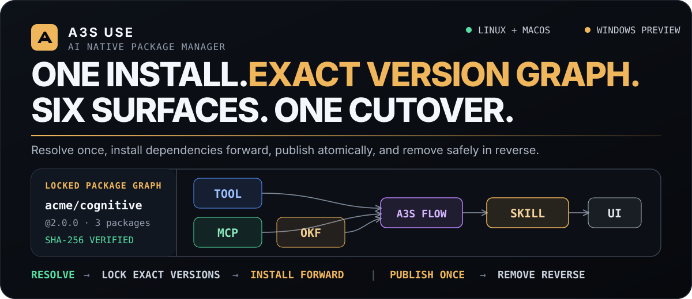
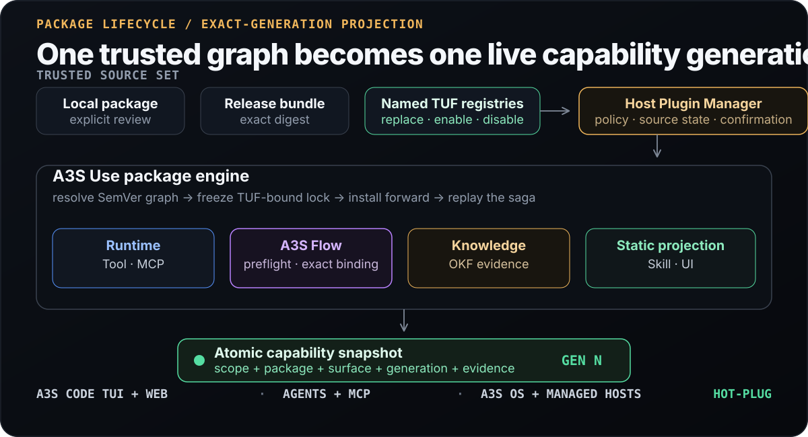

<p align="center">
  
</p>

<p align="center">
  <strong>One trusted package lifecycle for native tools and cognitive plugins on Linux, macOS, and Windows.</strong>
</p>

<p align="center">
  <a href="https://a3s-lab.github.io/Use/">Website</a> ·
  <a href="#quick-start">Quick start</a> ·
  <a href="#one-package-six-cognitive-surfaces">Package model</a> ·
  <a href="#replaceable-registries-exact-locks">Registries</a> ·
  <a href="#architecture">Architecture</a> ·
  <a href="#implementation-status">Status</a> ·
  <a href="ROADMAP.md">Roadmap</a>
</p>

## AI-native packaging, in one sentence

**A3S Use installs platform-native executables and agent-facing cognition as
one versioned, verifiable package graph.** A package can contribute Tool, MCP,
OKF, A3S Flow, Skill, and UI surfaces; Use resolves its SemVer dependencies,
binds every artifact to exact trust evidence, and projects only capabilities
that are ready for the admitted package generation.

A3S Use is the package manager for the A3S capability and security model. It
does not replace `apt`, Homebrew, or WinGet for arbitrary system software. The
umbrella CLI exposes built-in domains through `a3s use …` and cognitive-package
lifecycle through `a3s plugin …`; the standalone `a3s-use` engine remains
available for automation, embedding, and diagnostics.

> [!IMPORTANT]
> `v0.2` is the stable native package-management line. The current `main`
> branch is the `v0.3` cognitive-package line. Signed schema-v3 packages have
> deterministic dependency resolution, Registry/TUF-bound locks,
> dependency-forward installation, atomic capability publication, reverse
> uninstall, and crash replay. A3S Code now composes executable Tool Tasks,
> stdio MCP, immutable Skill/UI projection, and the real `a3s-flow` Native
> TypeScript host. CLI, TUI, and Web resolve the same strict `flow.json`
> identity and share workspace-local durable execution/history; Web verifies
> install, run, exact-generation upgrade, uninstall, and process-restart
> recovery. Dependency-graph upgrade now binds exact prior and candidate locks
> in operation plan v3, classifies Add/Replace/Remove/Retain, downloads only
> changed candidates, cuts over additions/replacements/removals once, preserves
> shared dependencies, and retires unreferenced prior generations in reverse
> order with crash-safe replay. Managed hosts negotiate this contract through
> host capabilities v3; v1/v2 remain frozen. Grant-aware graph paths now
> persist candidate Workspace Grants before package preparation, bind the exact
> Registry snapshot cutover, drain accepted calls before revoking prior grants,
> and roll back package and Grant candidates together before cutover. The
> standalone manager now binds trusted policy authority, exact confirmation,
> canonical Grant changes, resolved Grants, and signed ceilings into durable
> replay evidence, then selects the Grant-aware path for every permission-bearing
> graph mutation. Production Knowledge, Service/HTTP hosts, umbrella and
> managed-host Grant-authority forwarding, distributed Flow
> scheduling/resumption, and complete real-process cross-platform E2E remain
> release gates.
> [ROADMAP.md](ROADMAP.md) is the source of truth.

## Proof in the codebase

The package model is exercised as code, not only described in prose:

- [`plugin-v3-cognitive`](crates/extension/fixtures/packages/plugin-v3-cognitive/)
  contains all six cognitive surface kinds in one content-addressed package.
- [`A3sFlowLifecycleHost`](src/flow_runtime/lifecycle.rs) delegates preflight
  to the real `a3s-flow` `NativeTsRuntime` and never treats source presence as
  runtime readiness.
- [`FlowRuntimeBindingStore`](src/flow_runtime/store.rs) retains symlink-safe,
  exact-generation Flow evidence so a candidate generation cannot hide the
  last published generation.
- Package receipts, route leases, Runtime bindings, and Runtime observation
  retain exact N/N+1 generations; staging a candidate cannot replace the
  snapshot-selected generation, and retirement removes only receipt-owned N.
- [`CognitivePackageManager`](src/cognitive_package/) installs a verified
  dependency closure forward, reuses exact shared nodes, publishes graph
  additions, replacements, and removals once, and retires only unreferenced
  packages in reverse dependency order. Its injectable authorization provider
  binds host-owned actor and policy authority before the plan becomes
  immutable; pending-v2 records retain exact confirmation and Grant evidence
  without asking again during crash replay.
- [`PluginGrantLifecycleUnit`](src/plugin_lifecycle/grant.rs) binds one reviewed
  package plan to its exact Workspace Grant changes and signed ceilings. The
  grant-aware graph paths persist candidates before package preparation,
  checkpoint exact cutover evidence, and delay prior-grant revocation until
  accepted calls drain.
- [`capability watch`](src/capability_registry.rs) lets resident hosts observe
  package and projection changes without restarting.
- A3S Code's
  [`CodeCognitivePackageLifecycleFactory`](https://github.com/A3S-Lab/CLI/blob/main/src/components/cognitive_lifecycle.rs)
  injects the real Flow host and publishes a typed exact-generation catalog to
  both TUI and Web.
- The detached
  [Web hot-plug gate](https://github.com/A3S-Lab/CLI/blob/main/tests/web_plugin_marketplace.rs)
  proves `install → run → upgrade → run → uninstall → restart`, including
  source-drift rejection before compiler/event mutation and path-free history
  retention for both Flow generations.

## Quick start

Install the verified release through the umbrella A3S CLI, then inspect the
host and its live capability snapshot:

```bash
a3s install use --source release
a3s use doctor --json
a3s use capabilities --json
```

Try the built-in Browser and local OCR capabilities:

```bash
a3s use browser render https://example.com --output page.html
a3s use ocr extract ./scan.png --json
```

Build the standalone engine from source:

```bash
git clone https://github.com/A3S-Lab/Use.git
cd Use
cargo build --workspace --bins --locked
./target/debug/a3s-use doctor --json
./target/debug/a3s-use capability snapshot --json
```

Install one signed cognitive package and its complete dependency closure from
a host-selected Registry:

```bash
a3s-use install acme/research \
  --registry-name packages \
  --registry-url https://packages.example.org/a3s/ \
  --trust-root sha256:<64-hex-digits> \
  --version 2.0.0 \
  --json

a3s-use upgrade acme/research \
  --registry-name packages \
  --registry-url https://packages.example.org/a3s/ \
  --trust-root sha256:<64-hex-digits> \
  --json

a3s-use uninstall acme/research --json
```

Add `--package-lock-digest sha256:<64-hex-digits>` when applying a separately
reviewed resolution. A mismatch fails before a package archive is downloaded.

Prebuilt archives are available from
[GitHub Releases](https://github.com/A3S-Lab/Use/releases). A release archive
is one product surface: keep its binary, Skills, Dashboard, model assets,
licenses, and provenance files together.

## One package, six cognitive surfaces

A cognitive package is an npm-like distribution unit with one stable
`<publisher>/<name>` identity, one version, one ACL manifest, one required
`README.md`, optional SemVer dependencies, and zero or more named
contributions.

```text
acme-research/
├── a3s-use-extension.acl   identity · version · dependencies · surfaces
├── README.md               required package documentation
├── tools/                  native Task or Service artifacts
├── releases/               content-bound Tool/MCP descriptors
├── flows/                  A3S Flow TypeScript workflow sources
├── skills/                 SKILL.md files and supporting content
├── ui/                     integrity-bound static assets
└── okf/                    conformant knowledge bundles
```

Only the manifest and `README.md` names are fixed; contribution paths are
manifest-owned. The manifest uses
[A3S ACL](https://github.com/A3S-Lab/ACL), the A3S Agent Configuration
Language. ACL is not HCL and must be parsed with `a3s-acl`.

| Surface | Package contribution | Runtime owner and readiness boundary |
| --- | --- | --- |
| **Tool** | Native Task or long-lived Service | Selected Runtime provider, exact executable evidence, and health |
| **MCP** | stdio, HTTP, or immutable release descriptor | Runtime/Gateway adapter and standard MCP readiness |
| **OKF** | Open Knowledge Format concept graph | A3S Knowledge stage, promotion, observation, and scoped projection |
| **A3S Flow** | `flows/*.ts` source and explicit Tool/MCP/OKF edges | `a3s-flow` preflight plus exact-generation compiled binding; A3S Code adds workspace-local durable runs and path-free observation |
| **Skill** | Content-bound `SKILL.md` and supporting files | Static validation; projected only after declared dependencies are ready |
| **UI** | Integrity-bound static entry point | Sandboxed host rendering and bound Skill/MCP/Flow readiness |

The **package generation is the lifecycle unit**. Individual surfaces can be
selected and projected by name, but they cannot be independently installed,
upgraded, enabled, disabled, or uninstalled outside their owning package.

<details>
<summary><strong>Open a complete schema-v3 ACL example</strong></summary>

```acl
extension "acme/research" {
  schema_version = 3
  version        = "2.0.0"
  route          = "research"
  requires_use   = ">=0.3.0, <0.4.0"
  actions        = ["read", "execute"]

  dependency "acme/base" {
    version = "^1.4.0"
  }

  dependency "acme/vector-store" {
    version = ">=2.1.0, <3.0.0"
  }

  repository {
    url      = "https://github.com/acme/research"
    revision = "0123456789abcdef0123456789abcdef01234567"
  }

  tool "convert" {
    workload    = "task"
    interface   = "cli"
    executable  = "tools/convert/bin/convert"
    command     = "acme-research-convert"
    json_output = true
    interactive = false
    timeout_ms  = 120000
    activation  = "lazy"
    optional    = false
  }

  mcp "library" {
    transport  = "streamable-http"
    release    = "releases/library-mcp-v1.json"
    activation = "eager"
    optional   = false
  }

  okf "domain-knowledge" {
    format_version         = "0.2"
    root                   = "okf/domain-knowledge"
    content_digest         = "sha256:bd85b0b63adb32bdf616384a619286af4c32401542655dd09e00450902ab478d"
    concept_count          = 4
    file_count             = 7
    expanded_bytes         = 2053
    max_files              = 256
    max_concepts           = 64
    max_expanded_bytes     = 67108864
    max_document_bytes     = 1048576
    max_links_per_document = 2048
    optional               = false
  }

  flow "review" {
    engine         = "a3s-flow"
    runtime        = "native-ts"
    source         = "flows/review.ts"
    export         = "run"
    requires_tool  = ["convert"]
    requires_mcp   = ["library"]
    requires_okf   = ["domain-knowledge"]
    optional       = false
  }

  skill "review" {
    path          = "skills/review/SKILL.md"
    requires_tool = ["convert"]
    requires_mcp  = ["library"]
    requires_okf  = ["domain-knowledge"]
    requires_flow = ["review"]
    optional      = false
  }

  ui "review" {
    entry     = "ui/review/index.html"
    skill     = "review"
    bind_mcp  = ["library"]
    bind_flow = ["review"]
    optional  = false
  }
}
```

</details>

## Replaceable Registries, exact locks

Registry endpoints and trust roots are **host input**, never compiled into the
package engine. A host can select a mirror, a private service, or another
explicitly trusted TUF Registry without changing the resolver or package
journal. `CognitivePackageManager` accepts a root Registry plus a bounded set
of dependency Registries; every resolved node records its own source and TUF
provenance.

Dependency declarations contain only a canonical package ID and a SemVer
requirement. They cannot smuggle in a URL, trust root, target, or mutable tag.
Resolution fails closed on missing releases, incompatible constraints, cycles,
search bounds, or the same package appearing in more than one enabled source.

The canonical `a3s.use.plugin-package-lock.v1` freezes for every package:

- selected version and satisfied dependency edges;
- archive, expanded-package, and manifest digests;
- host target and A3S Use compatibility;
- Registry name, URL, channel, and target; and
- TUF root identity plus timestamp, snapshot, and targets versions.

The standalone command accepts an explicit replaceable root Registry. The
umbrella host supports named add, list, show, refresh, stable-name replace,
enable/disable, and remove:

```bash
a3s registry add https://packages.example.org/a3s/ \
  --trust-root ./root.json \
  --yes
a3s registry refresh packages
a3s registry disable packages --yes
a3s registry replace packages https://mirror.example.org/a3s/ \
  --trust-root ./mirror-root.json \
  --yes
a3s registry enable packages --yes

a3s plugin search research
a3s plugin inspect acme/research
a3s --output json plugin install acme/research --dry-run
a3s --output json plugin apply <operation-id> \
  --plan-digest <reviewed-plan-sha256> \
  --yes
```

Disabling a source removes it from Marketplace browsing, package lookup,
dependency resolution, refresh, and upgrade selection without deleting its ACL
or trust material. Replacement preserves the stable name and enabled state,
copies a file-backed TUF root into a content-addressed, symlink-safe managed
directory, and atomically switches the ACL only after the new trust material is
durable. The built-in official source cannot be replaced or toggled.

An installed receipt remains bound to its source name, URL, TUF root, channel,
and target digest. Removing, disabling, or changing that identity blocks
upgrades until the exact source is restored and enabled or the package is
explicitly migrated or reinstalled. Source administration never rewrites
receipt provenance.

## One A3S Flow model

A packaged Flow is an `a3s-flow` workflow, not a second workflow engine. The
different files describe layers of one identity:

| Layer | Responsibility |
| --- | --- |
| `a3s-use-extension.acl` | Package identity, source, export, lifecycle metadata, and Tool/MCP/OKF edges |
| `flows/*.ts` | Code-authored workflow and step handlers |
| `native-ts` | The currently supported source-to-runtime adapter |
| `flow.json` | A3S Code visual design and deployment document for the same Flow identity |
| `a3s-flow` | The sole engine for preflight, durable execution, event history, replay, scheduling, and observation |

`engine = "a3s-flow"` and `runtime = "native-ts"` are fixed by the current
schema. Use validates and content-binds the source, then
`A3sFlowLifecycleHost` calls the real `a3s-flow` compiler preflight. A durable
binding records the exact scope, package, surface, lifecycle generation,
manifest/package/source digests, export, entrypoint, and compiled artifact
digest.

Source integrity alone never marks a Flow ready. Capability projection reads
the binding for the **exact installed generation**, rechecks both source and
compiled artifact, and reports `Failed` on substitution. `stop` preserves the
binding for blue/green drain; `remove` deletes only the receipt-owned
generation. A missing binding remains pending.

The concrete Use adapter is implemented. A3S Code injects it through the shared
lifecycle factory, resolves its compiler from host configuration, and exposes
the typed live catalog through `GET /api/v1/plugins/flows`. TUI and Web consume
the same generation/revision watcher. Code's strict, path-free `installedFlow`
reference binds package, Flow, version, lifecycle generation, and source digest.
Before each new run, Code revalidates the current regular source file and
package containment, stages verified bytes under `.a3s/flow-runtime/`,
preflights the compiler, and only then creates a run binding and append-only
`a3s-flow` events. CLI/TUI `run`, `status`, and `logs` plus Web run/list/detail/
events APIs use that same store without OS login. Histories remain readable
after upgrade, disable, uninstall, and Code Web restart. The standalone Use
factory still fails closed when no lifecycle adapter is injected; distributed
workers, automatic scheduling/resumption, and production retention remain
release gates.

```text
GET  /api/v1/plugins/flows
POST /api/v1/plugins/flows/resolve
POST /api/v1/plugins/flows/run
GET  /api/v1/plugins/flows/runs
GET  /api/v1/plugins/flows/runs/{runId}
GET  /api/v1/plugins/flows/runs/{runId}/events
```

The current Code runtime is single-node and guards the local event store with
one cross-process workspace lock. It is durable across process restart; it does
not claim distributed worker placement. These routes are integrated at the Web
API layer; the current Marketplace frontend has no Flow run/history controls,
so CLI/TUI remain the interactive local execution surfaces.

## Trust and lifecycle

Every install enters through one explicit trust decision:

| Source | Trust decision | Intended use |
| --- | --- | --- |
| Local directory or archive | Human review plus `--allow-unsigned` | Development and private packages |
| Release-bundled package | Exact digest in a reviewed component plan | First-party release content |
| Remote Registry | Pinned TUF root, signed metadata, rollback checks, target digest | Production distribution |

The activation order keeps untrusted bytes away from live routes:

```text
resolve signed dependency graph
    → freeze exact package lock
    → build and review immutable plan
    → revalidate every Registry before payload download
    → verify and stage dependencies before dependents
    → prepare grants, Runtime, A3S Flow, static surfaces, and OKF
    → publish the changed closure in one capability generation
    → checkpoint the exact cutover and drain accepted prior calls
    → revoke superseded grants
    → remove unused packages in reverse dependency order
```

Local packages remain available for explicit development workflows:

```bash
a3s-use component install acme/calendar \
  --from ./calendar-package \
  --allow-unsigned \
  --json

a3s-use component status calendar --json
a3s-use extension disable acme/calendar --json
a3s-use extension enable acme/calendar --json
a3s-use component uninstall calendar --json
```

The graph coordinator resolves exact Add/Replace/Remove/Retain transitions.
Operation plan v3 binds the complete prior/candidate lock union, and host
capabilities v3 prevents an older managed host from accepting that plan. The
engine downloads only Add/Replace archives, prepares candidates
dependency-first, removes unreferenced routes in the same snapshot cutover,
automatically restores the prior graph after a pre-cutover failure, and retires
prior generations in reverse order with durable crash replay. Shared exact
dependencies remain selected and are neither downloaded nor rewritten.
The grant-aware graph coordinator persists candidate grants before package or
Runtime preparation, requires exact Registry generation and snapshot evidence
at cutover, restores package and Grant candidates together after a pre-cutover
upgrade failure, and drains prior calls before revoking prior grants. The
standalone manager derives canonical proposals, change sets, resolved Grants,
and candidate ceilings from the final plan, persists the complete authorization
bundle, revalidates injected authority on replay, and uses a grant-free path
only when the immutable plan contains no Grant-bearing package transition. The
umbrella Plugin Manager and managed-host adapters still need to forward the
same exact Use authority and confirmation evidence; production Knowledge,
Service, and Gateway composition is also still being wired.
The storage layer preserves exact package and Runtime generations across
candidate preparation, cutover, drain, rollback, and receipt-owned removal.
Required surfaces fail closed when their owning adapter is absent: Runtime
Service and HTTP MCP need Runtime/Gateway, OKF needs Knowledge, and Flow needs
the `a3s-flow` lifecycle host. No path silently falls back to a different
provider, execution model, or Registry.

## Architecture

<p align="center">
  
</p>

The ownership boundaries are deliberate:

- **The umbrella host** owns named Registry configuration, trust roots,
  enabled state, ACL policy, confirmation, secrets, and Runtime provider
  composition.
- **The shared Plugin Manager** is the only lifecycle application service for
  CLI, Web, management MCP, and remote managed-host adapters.
- **A3S Use** owns package validation, exact versions, immutable generations,
  operation journals, Workspace Grant prepare/cutover/rollback evidence,
  receipts, route leases, binding evidence, and capability reconciliation.
- **Runtime, A3S Flow, Gateway, and A3S Knowledge adapters** own execution,
  serving, preflight, and indexing. Their typed evidence is required before
  publication.
- **Package processes** retain native `argv`, stdin, stdout, stderr, status,
  HTTP, and standard MCP semantics. Use does not invent a universal action
  envelope or load untrusted code through `dlopen`.
- **A3S Code, Web, agents, and managed hosts** consume the atomic capability
  snapshot and watch its generation/revision for hot-plug updates.

The complete multi-resource mutation is a durable, idempotent saga because
package storage, grants, Runtime, Gateway, Knowledge, and capability projection
do not share one database transaction. The boundaries are frozen in
[ADR-001](docs/adr-001-plugin-runtime-broker-boundary.md) and
[ADR-002](docs/adr-002-cognitive-package-lifecycle-saga.md).

## Implementation status

| Area | Current state on `main` |
| --- | --- |
| Native package foundation | Available: bounded local/archive install, release bundles, TUF targets, receipts, atomic schema-v1/v2 lifecycle, snapshots, and watch |
| Schema-v3 package format | Implemented: Tool, MCP, OKF, A3S Flow, Skill, UI, required README, typed dependencies, and readiness graph |
| Dependency graph lifecycle | Available for signed remote packages: deterministic resolve, plan-v3 prior/candidate lock binding, Add/Replace/Remove/Retain, selected downloads, shared-node retention, one atomic publication, automatic pre-cutover rollback, reverse retirement/uninstall, and crash replay |
| Replaceable Registry input | Available in the package engine; host-selected URL/trust root and bounded dependency source set, with no compiled endpoint |
| Umbrella Registry management | Available: add/list/show/refresh, stable-name replace, enable/disable, and remove; disabled sources stay visible but are excluded from browsing and resolution |
| Tool/MCP runtime lifecycle | Typed adapters plus bounded exact-generation N/N+1 Runtime binding storage and observation implemented; standalone supports executable Tool Tasks and stdio MCP, while Services/HTTP require injected providers |
| A3S Flow lifecycle | Concrete `a3s-flow` preflight adapter, exact-generation binding store, artifact/source reinspection, lifecycle evidence, and capability observation implemented |
| A3S Flow product wiring | Exact `flow.json` identity, Code CLI/TUI plus Web API local durable execution and path-free observation, typed live catalog, and install/upgrade/uninstall/restart E2E implemented; visible Web run/history controls, distributed scheduling/resumption, and production retention remain pending |
| OKF lifecycle | Manifest/catalog/plan, validation, injected Knowledge port, exact-generation binding, last-good reconciliation, and lifecycle adapter implemented |
| Production Knowledge | Pending: backend indexing, scoped cited retrieval, session projection, and umbrella composition |
| Workspace Grant graph saga | Graph saga and standalone product wiring implemented: injected host authority, exact confirmation, canonical snapshot/change-set/resolved-Grant/ceiling persistence, automatic Grant-aware path selection, tamper rejection, exact Registry cutover, joint rollback, drain-before-revoke, and authorization-stable crash replay; umbrella and managed-host authority forwarding remains pending |
| Skill/UI lifecycle | Immutable validation and typed static projection implemented |
| Hot-plug projection | Capability snapshot/watch plus Code TUI readiness and detached-Web install-run-upgrade-run-uninstall-restart E2E implemented; production-provider and complete cross-platform real-process gates remain |
| Upgrade/rollback | Product-level remote upgrade, Add/Replace/Remove/Retain planning, package and Runtime N/N+1 retention, one graph cutover, joint package/Grant pre-cutover rollback, drain-before-Grant-revoke retirement, exact removal, dependency GC, and generation-stable crash replay implemented; standalone Grant plan/apply selection is wired, while production providers and umbrella/managed-host authority forwarding remain release gates |

The baseline intentionally fails closed when required permission, Runtime,
Gateway, Flow, Knowledge, or apply evidence is incomplete. Schema-v3 packages
cannot bypass the graph manager through legacy extension toggles.

Inspect immutable readiness evidence:

```bash
a3s use doctor --json
a3s use component list --json
a3s-use capability snapshot --json
```

Resident hosts can observe hot-plug changes without restarting:

```bash
a3s-use capability watch \
  --after-generation 12 \
  --after-revision <sha256> \
  --timeout-ms 30000 \
  --json
```

## Platform support

| Platform | Status | Current guarantee |
| --- | --- | --- |
| macOS arm64 / x86_64 | Supported | Release archives, managed providers, package lifecycle, and complete Browser gates |
| Linux arm64 / x86_64 | Supported | Release archives, managed providers, package lifecycle, and complete Browser gates |
| WSL | Supported through Linux | Linux runtime and filesystem contract |
| Windows x86_64 | Preview | Release archive, package-contract compile/test gates, Edge core profile, and local OCR process coverage |

Windows participates in the package target and release matrix, but complete
runtime parity still depends on the remaining plugin lifecycle and advanced
Browser gates.

## Workspace

| Crate | Responsibility |
| --- | --- |
| `a3s-use` | Facade, package graph engine, lifecycle adapters, capability reconciliation, and MCP entry points |
| `a3s-use-core` | Canonical package, catalog, Flow graph, plan, permission, grant, release, OKF, Knowledge, and managed-host contracts |
| `a3s-use-extension` | ACL manifests, recursive package/Flow/OKF validation, TUF catalog, package store, receipts, leases, and grants |
| `a3s-use-mcp-release-fixture` | Non-published headless MCP process and digest-pinned OCI lifecycle conformance gate |
| `a3s-use-science` | Reference external package implementation |

Browser and OCR are maintained in independent repositories and pinned to exact
revisions for release assembly.

## Development

Run checks from this repository, not from the parent A3S monorepo:

```bash
cargo fmt --all -- --check
cargo test --workspace --all-features --locked
cargo clippy --workspace --all-targets --all-features --locked -- -D warnings
RUSTDOCFLAGS="-D warnings" cargo doc --workspace --all-features --no-deps
```

On x86_64 Linux with Docker and `musl-tools`, run the real digest-pinned MCP
release gate:

```bash
./scripts/mcp-release-container-conformance.sh
```

## Documentation

- [Official website](https://a3s-lab.github.io/Use/)
- [Plugin Platform Roadmap](ROADMAP.md)
- [Plugin Platform Architecture](docs/plugin-platform-architecture.md)
- [Plugin Lifecycle and Security](docs/plugin-platform-lifecycle-and-security.md)
- [Plugin Contract Reference](docs/plugin-contracts.md)
- [Cognitive Package Development Plan](docs/plugin-platform-development-plan.md)
- [Runtime Broker ADR](docs/adr-001-plugin-runtime-broker-boundary.md)
- [Cognitive Package Lifecycle Saga ADR](docs/adr-002-cognitive-package-lifecycle-saga.md)
- [External Repository Capabilities](docs/external-repositories.md)
- [Immutable Release Descriptors](docs/release-descriptors.md)
- [Agent Browser Compatibility Baseline](docs/agent-browser-parity.md)
- [Third-Party Notices](THIRD_PARTY_NOTICES.md)

## License

A3S Use is licensed under the [MIT License](LICENSE). Release archives retain
third-party licenses and provenance notices.
