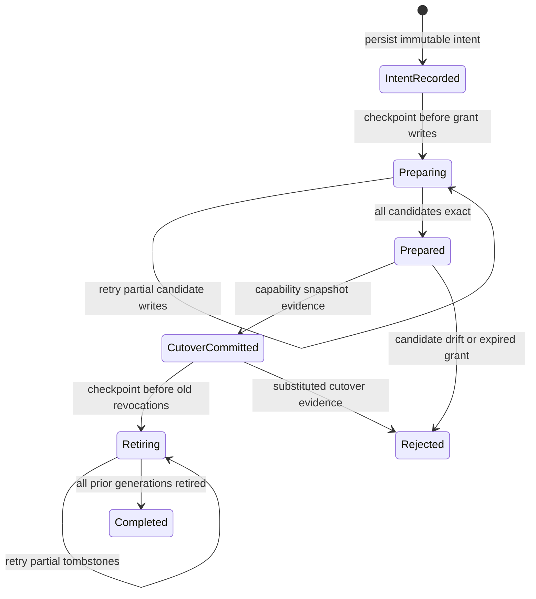

# A3S Use Plugin Platform Architecture

- Status: accepted target architecture; implementation in progress
- Planning baseline: 2026-07-30
- Product amendment: first-class OKF knowledge contribution accepted; M0K-A
  bundle contract frozen 2026-07-31, M0K-B control plane frozen 2026-08-01,
  package-level six-surface lifecycle plus P0 hosts accepted 2026-08-03, the
  cognitive-package dependency/lock foundation accepted 2026-08-03, and A3S
  Flow accepted as the single workflow engine and the exact-generation
  preflight binding foundation accepted on 2026-08-04
- Roadmap: [A3S Use Plugin Platform Roadmap](../ROADMAP.md)
- Delivery plan: [Plugin Platform Development Plan](plugin-platform-development-plan.md)
- Operations: [Plugin Lifecycle and Security](plugin-platform-lifecycle-and-security.md)
- Runtime decision: [ADR-001: Host-Owned Plugin Runtime Broker](adr-001-plugin-runtime-broker-boundary.md)
- Lifecycle decision: [ADR-002: Cognitive Package Lifecycle Saga](adr-002-cognitive-package-lifecycle-saga.md)

This document defines the target architecture for installing and operating an
immutable plugin that may contribute executable Tools, standard MCP servers,
OKF knowledge, A3S Flow workflows, Skills, and sandboxed UI. It
refines the roadmap; the roadmap remains the source of truth for delivery
status and priority.

## Executive Decision

A plugin is one signed, immutable package and one lifecycle aggregate. Its
surfaces are not copied into unrelated ownership roots and are not activated
independently.

A3S Use stores the canonical package, records desired state, and reconciles
each declared surface into the host that owns its execution:

| Surface | Meaning | Activation target |
| --- | --- | --- |
| Skill | Instructions and supporting content | A managed Skill projection or session Skill registry |
| Tool Task | A non-interactive CLI program used to perform real work | An A3S Runtime Task, or a constrained legacy native runner |
| Tool Service | A private HTTP service used to perform real work | An A3S Runtime Service behind a scoped binding |
| MCP | A standard MCP server, distinct from a Tool | Runtime Service for Streamable HTTP; supervised session for stdio |
| Flow | A durable workflow with explicit Tool/MCP/OKF capability edges | An injected `a3s-flow` engine and typed runtime adapter |
| UI | Integrity-bound static HTML, CSS, and JavaScript | A3S Code/Web sandbox with declared backend bindings |
| OKF | A conformant Open Knowledge Format bundle of cross-linked Markdown concepts | A3S Knowledge service, host OKF registry, and local cited-search index |

Tool, MCP, OKF, Flow, Skill, and UI have an implemented schema-v3 contract baseline.
M0K-B adds exact manifest/package validation, catalog and plan evidence,
Knowledge receipt/observation/projection contracts, and dependency-gated
reconciliation for OKF. M0K-C-A adds the injected Knowledge port, exact-byte
stage request, evidence-checking client, durable bounded generation store, and
a package-saga OKF adapter. The package-level intent, journal, coordinator,
typed Runtime/static adapters, and P0 package/capability hosts are implemented.
Schema-v3 receipt generation binding, deterministic immutable roots, atomic
publish/hide, generation-specific route leases, and bounded package/Runtime
N/N+1 receipt storage now enforce the package boundary. The dependency-graph
coordinator binds exact prior/candidate locks, implements one
Add/Replace/Remove cutover, preserves shared Retain nodes, automatically rolls
back before cutover, retires unreferenced prior generations in reverse order,
and replays every GC boundary without generation inflation. Grant-aware graph
paths now persist candidate Grants before package preparation, bind exact
Registry cutover evidence, jointly roll back candidates before cutover, and
drain accepted prior calls before Grant retirement. Standalone Grant
planning/apply selection is now implemented; umbrella/managed-host authority
forwarding, production provider composition, the A3S Knowledge index backend,
and scoped cited retrieval remain to be implemented. Missing promoted evidence
therefore stays explicitly unpublished.

Flow has one engine identity: `a3s-flow`. The manifest separately names the
currently admitted `native-ts` runtime adapter and content-bound source. Use
owns distribution, dependency closure, integrity, lifecycle ordering, and the
typed capability catalog. The embedding host owns compiler preflight, durable
execution, replay, storage, and observation. A3S Code's `flow.json` is a visual
design/deployment document adapted to this same identity; it is not a second
workflow engine or package lifecycle.

Schema v3 also implements npm-like package dependencies without importing npm's
execution or registry model. A manifest names only `<publisher>/<name>` and a
canonical SemVer requirement. A bounded deterministic resolver selects a
transitive closure from host-owned named Registries, and
`a3s.use.plugin-package-lock.v1` freezes every selected version, digest,
Registry/TUF identity, target, channel, and host compatibility boundary. The
standalone signed-Registry CLI exposes this graph through `install`/`uninstall`
and compatible remote `component` dispatch. Umbrella Code/Web lifecycle-factory
composition remains the release boundary.

In this architecture, **Tool does not mean an MCP `tools/list` item**. A Tool
is a workload on which a Skill or UI can depend. It keeps its native CLI or
HTTP contract. A3S Use does not translate it into a private tool protocol or a
universal action schema.

Static UI is not a Runtime workload. Only a UI's declared Tool or MCP backend
is deployed through Runtime.

OKF is also not a Runtime workload. It is normalized, shareable knowledge:
UTF-8 Markdown concepts with properly delimited YAML frontmatter, one required
non-empty `type` for each non-reserved concept, bundle-relative path identity,
and standard Markdown graph links. The frozen content contract targets current
OKF v0.2 with explicit v0.1 compatibility. Raw source formats are compiler
inputs, not searchable OKF authority. A3S Use owns package integrity and
exact-generation evidence; A3S Knowledge owns conformant atomic promotion,
indexing, and cited retrieval.

## Architectural Drivers

The design optimizes for:

1. metadata-only discovery and payload-on-demand installation;
2. one identity, trust decision, generation, and uninstall boundary for all
   package surfaces;
3. safe user and policy-authorized agent lifecycle operations;
4. atomic capability publication even though package storage, Runtime, and
   Code/Web do not share a database transaction;
5. exact-generation routing and in-flight-call draining;
6. provider-neutral execution with explicit capability negotiation;
7. diagnosable partial failure and crash recovery;
8. no ambient authority from Skill text, UI or OKF content, CLI arguments, or
   remote service responses; and
9. compatibility with existing extension schema v1/v2 packages.

The design does not make Runtime a package manager, make A3S Use a scheduler,
or invent another agent RPC protocol.

## System Boundaries

```text
                         signed registries
                    metadata index + package target
                                |
                         Plugin Catalog
                   verify / search / resolve / cache
                                |
 user CLI/Web ----> Plugin Manager <---- management MCP ---- agent
                         plan / apply
                                |
                    Policy and Grant Broker
                                |
                  Package Store + Operation Log
                                |
                  Package Lifecycle Coordinator
               one intent / ordered hosts / crash replay
                                |
                      Surface Reconciler
        +----------+----------+-----------+---------+
        |          |          |           |         |
    Skill host  Tool broker  MCP host   UI host  OKF host
        |          |          |           |         |
        |       A3S Runtime --+       Code/Web   Knowledge
        |       Task/Service           sandbox   index
        +----------+----------+-----------+---------+
                                |
                 atomic Capability Snapshot
                                |
                       active A3S sessions
```

The control plane resolves, authorizes, installs, and reconciles desired state.
The data plane executes a Tool, serves MCP, runs a durable A3S Flow, renders
UI, supplies Skill instructions, or retrieves cited OKF knowledge. A data-plane surface cannot
mutate plugin lifecycle state.

### Ownership

| Component | Owns | Does not own |
| --- | --- | --- |
| Umbrella A3S host | Registries, trust roots, confirmation, ACL policy, workspace grant decisions | Package extraction, grant-record I/O, or surface execution |
| A3S Use | Package validation, receipts, grant-record persistence, desired state, reconciliation, bindings, leases, capability publication | Policy authority, Runtime provider internals, or plugin API vocabulary |
| A3S Runtime | Digest-bound Task/Service execution, observation, stop, remove, logs | Plugin resolution, provider selection, Skill/UI/OKF projection |
| A3S Flow | Workflow compilation, preflight, durable execution, replay, event storage, and observation | Package resolution, permission grants, or a parallel `flow.json` lifecycle |
| A3S Gateway | Private endpoint routing and scoped access to Service bindings | Package lifecycle or permission grants |
| A3S Code/Web/Knowledge | Session projection, managed Skill roots, sandboxed UI, conformant OKF promotion/index | A second package manager |
| Cloud node host adapter | Authenticated delivery to one fenced managed workspace through `PluginHostManager` | Installer, lifecycle journal, grant/binding store, reconciler, scheduler, or plugin execution RPC |
| Plugin publisher | Surface implementation, manifest, release descriptors, provenance | User policy or host authority |

## Domain Model

### Stable identities

| Entity | Identity |
| --- | --- |
| Plugin | `<publisher>/<name>` |
| Plugin release | Plugin ID + semantic version + package digest |
| Installed generation | Plugin release + monotonically increasing activation generation |
| Surface | Plugin ID + surface kind + manifest-local surface ID |
| Runtime binding | Installed generation + surface ID + explicit provider ID |
| Workspace grant | Workspace + package digest + permission digest |
| Operation | Random operation ID + canonical plan digest |

A route, command alias, display name, endpoint, filesystem path, and Runtime
unit ID are projections. None is an ownership identity.

Remote management uses the same ownership model. A
`PluginManagedScope` binds one opaque host/workspace/authority tuple to an
exact positive fence generation and digest. The versioned `PluginHostManager`
port accepts separate plan, digest-only apply, enablement, and observation
contracts, all bound to the host's exact capability descriptor. It does not
define an `execute(plugin, action, payload)` protocol. A Cloud node adapter is
only a delivery adapter over this port; it cannot reproduce the Plugin Manager
saga or allow local mutation adapters to compete inside the managed scope.

### Plugin aggregate

The aggregate contains:

- one immutable manifest and package digest;
- zero or more named Skills;
- zero or more named Tool Tasks or Tool Services;
- zero or more named MCP servers;
- zero or more named A3S Flow workflows;
- zero or more named UI contributions;
- zero or more named OKF knowledge contributions;
- an acyclic dependency graph among those surfaces;
- zero or more versioned dependencies on other cognitive packages;
- package-level permission ceilings;
- compatibility requirements and exact external release dependencies; and
- one desired activation state per workspace scope.

A Flow may require Tools, MCP surfaces, and named OKF contributions. A Skill
may require a Flow as well as direct Tool, MCP, and OKF contributions. A UI may
bind to a Flow, Tool Service, or MCP surface. Required dependencies must belong
to the same immutable plugin generation unless the package resolver pins an
external plugin release by version and digest.

All declared surfaces are required by default. A publisher may explicitly mark
a surface optional, but any optional surface referenced by a required Flow,
Skill, UI, or OKF consumer becomes part of the required readiness closure. Failure
outside that closure produces `degraded`; failure inside it blocks atomic
activation.

### Desired and observed state

Desired state is deliberately small:

```text
absent | installed-disabled | enabled
```

Observed state is evidence, not authority:

```text
unresolved | staging | installed | reconciling | ready
degraded | broken | draining | removing | removed
```

Each surface also reports `pending`, `prepared`, `starting`, `healthy`,
`failed`, `draining`, or `stopped`. Plugin `ready` means every enabled,
required surface has satisfied its surface-specific readiness gate. It must
never be inferred merely from an enabled receipt.

## Package Contract

### Package granularity

A package should be the smallest independently useful trust, permission,
upgrade, and uninstall unit. A large collection such as Science should publish
separate catalog packages when its data-source Tools can be selected
independently. A no-payload metapackage may depend on a reviewed set for users
who want the complete collection.

Shared binaries, images, models, and data are exact content-addressed
dependencies. The resolver may deduplicate their bytes, but it must not merge
the ownership, grants, or lifecycle of the plugins that consume them. Search
and inspect fetch metadata only; install downloads the selected package and its
exact dependency closure, not the entire publisher catalog.

### Immutable layout

The canonical package remains under a content-addressed A3S Use root:

```text
plugins/<publisher>/<name>/<version>-<digest>/
  a3s-use-extension.acl
  README.md
  skills/
  tools/
  mcp/
  ui/
  okf/
  releases/
  provenance/
```

Directories are illustrative; manifest paths are authoritative. Every path is
package-relative, canonicalized, bounded, and digest-verified. Links, device
files, traversal, duplicate archive paths, and case-folding collisions fail
closed.

The filename `a3s-use-extension.acl` and schema v1/v2 remain readable during
migration. Schema v3 adds named, repeatable surfaces, package dependencies, and
a required bounded UTF-8 `README.md`. Internally the domain type is
`PluginManifest`; changing the on-disk manifest filename is unnecessary until a
separately versioned migration provides material value.

The `okf/` directory is never discovered implicitly. Each schema-v3 `okf`
block binds the named surface, bundle root, format version, exact content
digest, counts, byte limits, and optionality. Package admission validates the
entire directory against that contract; an undeclared directory has no
capability meaning.

### Illustrative schema v3

```acl
extension "acme/research" {
  schema_version = 3
  version        = "2.0.0"
  route          = "research"
  requires_use   = ">=0.3.0, <0.4.0"
  actions        = ["read", "mutate"]

  dependency "acme/base" {
    version = "^1.4.0"
  }

  dependency "acme/vector-store" {
    version = ">=2.1.0, <3.0.0"
  }

  repository {
    url      = "https://github.com/acme/research"
    revision = "0123456789abcdef0123456789abcdef01234567"
  }

  tool "convert" {
    workload      = "task"
    interface     = "cli"
    executable    = "tools/convert/bin/convert"
    command       = "acme-convert"
    json_output   = true
    interactive   = false
    timeout_ms    = 120000
    activation    = "lazy"
  }

  tool "index" {
    workload          = "service"
    interface         = "http"
    release           = "releases/index-tool-v1.json"
    base_path         = "/api"
    contract          = "tools/index/openapi.json"
    activation        = "eager"
  }

  mcp "library" {
    release   = "releases/library-mcp-v1.json"
    transport = "streamable-http"
  }

  okf "domain-knowledge" {
    format_version         = "0.2"
    root                   = "okf/domain-knowledge"
    content_digest         = "sha256:bd85b0b63adb32bdf616384a619286af4c32401542655dd09e00450902ab478d"
    concept_count          = 4
    file_count             = 7
    expanded_bytes         = 2053
    max_files              = 256
    max_concepts           = 64
    max_expanded_bytes     = 67108864
    max_document_bytes     = 1048576
    max_links_per_document = 2048
    optional               = false
  }

  skill "review" {
    path          = "skills/review/SKILL.md"
    requires_tool = ["convert", "index"]
    requires_mcp  = ["library"]
    requires_okf  = ["domain-knowledge"]
  }

  ui "review" {
    entry     = "ui/review/index.html"
    skill     = "review"
    bind_tool = ["index"]
  }
}
```

The checked-in
[`plugin-v3.acl`](../crates/extension/fixtures/manifests/plugin-v3.acl) and
[`plugin-v3-okf.acl`](../crates/extension/fixtures/manifests/plugin-v3-okf.acl)
fixtures freeze the executable and OKF contract shapes with adjacent stable
SHA-256 goldens. Fixture bytes use LF endings and include the final repository
newline in their digest.

This example records deployment and binding facts, not the Tool's business
operations. The CLI owns its arguments and exit codes. The HTTP service owns
its routes and response schemas. An optional content-bound OpenAPI document is
documentation and validation evidence, not a new A3S execution protocol.

### Package dependency resolution and lock

Package dependency declarations are deliberately smaller than source
configuration. They contain only a canonical package ID and canonical SemVer
requirement; manifest-controlled Registry URLs, trust roots, channels, targets,
or mutable aliases are invalid. Catalog v3 repeats the normalized dependency
inventory, and package admission requires it to equal the ACL manifest exactly.

The host supplies one selected root Registry plus a bounded set of enabled
dependency Registries. Resolution:

1. validates complete verified catalog-v3 candidates and host compatibility;
2. rejects a dependency identity that appears in multiple Registry trust
   identities rather than selecting one silently;
3. deterministically prefers the highest compatible target-specific release,
   with bounded backtracking when later constraints conflict;
4. rejects missing, incompatible, conflicting, cyclic, unreachable, or
   over-bound graphs; and
5. emits one canonical `a3s.use.plugin-package-lock.v1` closure.

Each locked node contains its complete verified catalog record and exact
dependency edges. The lock therefore binds version, archive/manifest/package
digests, target, channel, Registry name/URL, TUF root, TUF role versions, and
the selected A3S Use host version/target. The immutable operation-plan envelope
binds both the lock and its digest; plan transitions must cover the same root
and dependency nodes with exact selected state and source provenance.

Apply revalidates every locked Registry snapshot and candidate before any
archive download, then downloads in topological dependency-first order. The
graph coordinator prepares only changed generations, permits `Retain` only for
an exact Registry/TUF-backed generation already visible in the current
capability snapshot, and publishes changed nodes through one immutable snapshot
cutover. Uninstall uses the reverse topological order, while direct removal is
rejected when another installed manifest still depends on the package. A
partially written enabled receipt is not visibility evidence; the immutable
snapshot is the commit point and exact replay completes or repairs the cutover.

### OKF contribution contract

The first-class OKF surface is an additive schema-v3 contract. Its shared
content and M0K-B control-plane contracts reuse the package identity, plan,
receipt, grant, reconciliation, and capability-generation machinery already
present. They do not add another manager, lifecycle store, Runtime route, or
capability registry.

The contract binds:

- a manifest-local OKF surface ID and bundle-relative root;
- the declared Open Knowledge Format version, initially current `0.2` plus
  explicit `0.1` fallback behavior;
- the canonical expanded content digest, file count, and byte limits;
- required UTF-8 Markdown plus properly delimited YAML frontmatter for every
  non-reserved concept;
- exactly one non-empty scalar `type` per non-reserved concept, with optional
  standard OKF fields and producer extensions preserved without executable
  semantics;
- canonical bundle-relative path identity, reserved `index.md`/`log.md`
  handling, and bounded standard Markdown link validation;
- optional same-generation consumer dependencies, such as a Skill requiring a
  named OKF surface;
- the host projection identity, last-good promoted generation, and index
  observation digest; and
- receipt-owned uninstall behavior that never removes personal notes, raw
  compiler sources, or another package's index generation.

The machine boundary is split deliberately:

- `a3s.use.okf-bundle.v1` binds immutable content;
- catalog v3 and operation-plan v2 bind package selection and impact;
- `a3s.use.okf-projection-receipt.v1` records one staged candidate;
- `a3s.use.okf-knowledge-observation.v1` reports host state and the selected
  last-good generation; and
- `a3s.use.okf-capability-projection.v1` contains only exact promoted evidence
  safe for a scope-aware capability generation.

OKF conformance is deliberately permissive. Unknown concept types and
frontmatter keys remain valid, missing optional indexes remain valid, and safe
dangling concept links produce diagnostics rather than rejection. Package
admission separately rejects paths that resolve outside the bundle, unsafe
resource acquisition, expansion-limit violations, and other package-boundary
hazards. A v0.2 `Attested Computation` may describe an executor and attester,
but those fields are inert content: execution requires separately declared,
authorized Tool or host bindings and is never inferred from OKF text.

Installation does not compile arbitrary PDF, Office, image, archive, or web
content. Independent compilers may produce conformant OKF, but the package
contains the exact normalized bundle reviewed by the plan. The host validates
and stages it, then A3S Knowledge atomically promotes the generation. Search
continues to serve the last good generation if conformance or indexing of the
candidate fails.

The M0K-C-A stage request owns the validated `OkfBundleFile` snapshot and
re-runs conformance over borrowed bytes immediately before calling the injected
adapter. Adapter output is accepted only when its receipt and observation bind
the reviewed operation, scope, surface, generation, package, manifest, bundle,
and index evidence. Use persists the exact pair below
`<state>/bindings/knowledge/<scope-sha256>/<publisher>/<package>/<surface>/`
with atomic file replacement and a cross-process store lock. The highest
candidate observation is authoritative: it may select a retained exact
promoted record as last-good, while a highest `removed` record suppresses all
fallback.

OKF content is guidance and evidence, not authority. Frontmatter, concept text,
links, resources, or compiler provenance cannot grant filesystem, network,
secret, Runtime, lifecycle, or cross-workspace access.

### Release descriptors

Existing [`a3s.use.mcp-release.v1` and
`a3s.use.skill-release.v1`](release-descriptors.md) remain the canonical
hosted MCP and Skill release boundaries.
[`a3s.use.tool-release.v1`](release-descriptors.md#tool-v1) uses the same
canonical JSON, provenance, compatibility, dependency, artifact-digest, and
size rules. Its checked-in Task and Service fixtures are the cross-SDK
contract goldens.

The Tool descriptor adds exactly one workload contract:

- Task + CLI: process entrypoint, non-interactive execution, timeout, output
  bounds, and exit semantics;
- Service + HTTP: named port, private network mode, base path, health check,
  startup deadline, graceful shutdown, and optional API contract digest.

Secrets, mutable tags, provider configuration, endpoint URLs, and plaintext
environment values are deployment policy and must not enter a release
descriptor.

## Package Lifecycle Coordination

The package lifecycle coordinator and the Surface Reconciler consume the same
canonical schema-v3 surface graph. Above it, the package-graph coordinator
consumes the exact package lock. This prevents orchestration from inventing a
second package/surface inventory or dependency order.

The coordinator persists one versioned intent binding operation, reviewed plan,
scope, package/manifest digests, generation, action, surfaces, and deterministic
idempotency keys. It prepares dependencies in forward level order, publishes
one capability generation only after every required checkpoint succeeds, and
hides, drains, then stops or removes contributions in reverse level order.
Optional preparation failures are recorded as degraded evidence only when they
are outside the required dependency closure.

Typed host ports keep semantics explicit: package commit/removal, capability
publish/hide/drain, Tool, MCP, OKF, Flow, Skill, and UI. Concrete foundations cover
explicit Runtime selections for release-backed Tool/MCP workloads, static
native and stdio launchers, immutable Flow/Skill/UI evidence, and receipt-owned
OKF stage/promote/remove. The coordinator is not an invocation protocol and cannot
install a contribution independently from its package.

For a dependency closure, package generations are committed and prepared in
lock topological order. `Retain` transitions have no lifecycle unit and no
recommit side effect. One graph publication host receives the exact lock plus
all changed intents and returns package-keyed evidence from a single Registry
snapshot cutover. Cascade uninstall skips retained nodes and removes changed
nodes in exact reverse order.

The production package adapter commits a deterministic immutable root and a
schema-v3 receipt bound to the exact package digest, manifest digest, and
lifecycle generation. It remains `installed-disabled` until the capability
adapter atomically publishes the complete route binding. Hide precedes the
exclusive lease drain; removal deletes only that exact root. Legacy schema-v1
and schema-v2 operations remain compatible, but their toggles reject a
lifecycle-managed receipt instead of bypassing the package journal.

The durable journal is bounded, atomically replaced, cross-process locked, and
validates path ownership and every prior receipt before replay. Its detailed
decision is [ADR-002](adr-002-cognitive-package-lifecycle-saga.md).

`CognitivePackageManager` persists a root-owned exact package lock and a
separate pending graph operation. Pending records bind the reviewed envelope,
the in-window admission time, and every changed package's exact manifest and
generation. This lets restart complete lifecycle journals after publication,
or resume reverse removal after the root receipt and installed-root graph have
already disappeared. Both stores reject symlinked ownership paths and sync
their parent directory after atomic creation or removal.

Embedding hosts implement `CognitivePackageLifecycleFactory` to compose their
typed Runtime, Gateway, A3S Flow, Knowledge, Skill, and UI adapters. Registry
resolution and graph orchestration remain single-source Use logic; a host may
not fork the resolver or create per-surface installation units. The standalone
factory supports native executable Tasks, stdio MCP, and immutable Skill/UI
projection, and fails before publication when a required Runtime Service, HTTP
MCP, Flow, or OKF owner is absent.

A3S Code now composes executable Tool Tasks, stdio MCP, the real `a3s-flow`
preflight host, and immutable Skill/UI projection through this factory. Its TUI
and Web adapters consume one exact-generation watcher, including a typed live
Flow catalog and install/upgrade/uninstall hot-plug coverage. The standalone
package manager now drives dependency-bearing upgrade through the shared graph
coordinator: plan v3 binds the complete prior/candidate lock union,
Add/Replace archives prepare forward, removed routes leave in the same
publication, and replaced or unreferenced generations retire in reverse order.
Exact shared dependencies remain selected without download or receipt rewrite.
Production Knowledge, Runtime Service, Gateway/HTTP MCP, grant,
management-MCP, and managed-host composition remain pending. Storage never
overwrites the snapshot-selected retained generation.

## Surface Reconciliation

The Surface Reconciler is the architectural center of the system. It consumes
an immutable package generation, desired state, grants, and Runtime provider
capabilities. It produces per-surface bindings and one atomic capability
snapshot.

Reconciliation is level-based and idempotent:

```text
observe current package, grants, bindings, Runtime units, and projections
  -> calculate desired surface graph
  -> validate dependency and provider requirements
  -> apply or repair individual bindings
  -> wait for required readiness
  -> publish one new capability generation
  -> drain and garbage-collect superseded bindings
```

It never treats a successful process spawn as readiness and never silently
changes provider after a plan was approved.

### Surface placement

#### Skill

The Skill remains canonical inside the package root. Its entrypoint and
supporting files are verified before projection.

The preferred projection is a capability-registry entry that lets A3S Code add
the immutable package Skill root to a session. A host that requires a physical
`skills/` directory receives a receipt-owned, generation-scoped projection and
an atomic root switch. The user's hand-managed Skill directory is not the
canonical package store and is never modified without an explicit host
adapter.

A Skill is published only after every required Tool and MCP binding is
prepared or healthy. Skill text cannot add dependencies or permissions.

#### Tool Task

A Tool Task is a real CLI workload. New portable packages should map it to
`RuntimeUnitClass::Task`. Each invocation binds the exact package generation,
preserves native `argv`, stdout, stderr, and exit status, enforces resource and
time limits, and produces an auditable invocation ID.

A managed command shim may be projected into a session-specific `bin/`
directory. The shim resolves only its declared plugin and Tool ID through the
Tool Binding Broker; it never accepts an arbitrary executable path. The
package executable itself is not copied into a global binary directory.

The canonical command name should be publisher-qualified. A short alias is a
scope-local projection that must be conflict-checked during planning. A new
generation cannot replace an alias owned by another plugin.

Existing package-relative native CLI surfaces use a compatibility runner until
a selected Runtime provider supports their artifact media type. They are
reported as `native-unconfined` wherever filesystem, process, environment, and
network restrictions are not actually enforced. Such a Tool cannot use the
unattended agent-allow path.

#### Tool Service

A Tool Service maps to `RuntimeUnitClass::Service`. It is deployed from a
digest-pinned artifact, must pass its declared health contract, and binds only
to a private Runtime network. A3S Gateway publishes a scope-local endpoint
reference after authorization; Runtime does not expose a mutable public port.

The Binding Broker resolves that endpoint for an authorized session. Agents
use the Tool's documented HTTP API, and a bound UI receives an origin-scoped
reverse-proxy path. Neither receives provider credentials or a direct Runtime
control token.

#### MCP

Streamable HTTP MCP maps to a Runtime Service and uses the existing immutable
MCP release descriptor. Readiness requires both declared HTTP health and a
successful standard MCP initialize/probe.

Stdio MCP remains a supervised session surface for Runtime v0.2 because its
`exec` operation is unary and non-interactive; it cannot preserve a long-lived
stdin/stdout protocol. It may move to Runtime only after Runtime exposes an
explicit bidirectional session contract. It must not be emulated through
repeated `exec` calls.

MCP `tools/list` results are capabilities of the MCP surface. They are not
Plugin Tool surfaces and are not written into the package manifest as Tool
workloads.

#### UI

UI assets stay in the immutable package and are served by Code/Web from a
digest-bound generation on a unique sandbox origin. The iframe has no ambient
host DOM, filesystem, network, secret, or lifecycle authority.

A UI may bind only to dependencies declared in its manifest. A Tool Service
binding is exposed as a same-origin, path-scoped reverse proxy; MCP interaction
uses the host's existing reviewed bridge. Removing or upgrading the plugin
revokes the binding before its old assets are collected.

## Workspace Permission Grants

The signed package permission record is a ceiling, not an activation grant.
The canonical `a3s.use.plugin-workspace-grant.v1` contract binds one workspace,
package ID and digest, signed ceiling digest, resolved permission digest,
policy digest, actor, decision, confirmation evidence, grant time, and optional
expiry. It contains no secret values.

Resolved permissions reuse the typed permission shape and can only narrow the
signed ceiling. Filesystem grants must stay under an allowed scope/path and
cannot upgrade read to read-write. Network hosts remain exact and ports can
only be removed. Resource values can only decrease. Native execution,
child-process authority, private Service exposure, and secret names cannot be
added. UI methods and path prefixes can only narrow a declared Tool binding.

Secret-bearing grants require an explicit `ask` decision confirmed by a user.
An agent grant cannot carry secret authority. Canonical grant and permission
digests can be included directly in operation-plan workspace impacts and
Runtime semantics evidence.

Grant authorization has a two-phase digest graph:

```text
resolved permissions + policy
  -> canonical grant proposal
  -> immutable operation plan binds proposal digest
  -> user confirmation binds plan digest + proposal digest
  -> deterministic final grant binds confirmation digest
```

The proposal contains no premature confirmation claim. `allow` finalizes at
trusted apply time without confirmation; `ask` requires an exact, in-window
user confirmation record. This prevents the circular construction that would
result if a pre-confirmation plan tried to contain the digest of a final grant
whose own digest includes later confirmation evidence.

The existing operation-plan workspace impact carries two aggregate references:
`grantBeforeDigest` is the canonical active-grant snapshot, while
`grantAfterDigest` is the canonical sorted multi-package change set. The latter
contains exact before evidence and/or after proposals per package. Validation
derives the required package keys and sides from Add, Replace, and Remove
transitions for root plus dependencies. Retained packages are no-op; an
injected, missing, reordered, stale, or generation-mismatched entry fails
closed.

One plan-level operation confirmation authorizes an `ask` apply, including a
revoke-only operation. Each new proposal confirmation must refer to the same
plan and confirmation time. Resolution returns candidate grants for the
prepare phase and exact prior grant evidence for retirement after capability
cutover. Both share `stateRevision + 1`, but their side effects remain ordered
by the lifecycle saga rather than pretending to be one filesystem transaction.

Durable grant state is stored separately from package receipts at
`<state-root>/grants/<scope-sha256>/<publisher>/<package>/<package-sha256>.json`.
Each bounded record is either a revisioned
`a3s.use.plugin-workspace-grant-receipt.v1` receipt or an
`a3s.use.plugin-workspace-grant-revocation.v1` tombstone that binds the exact
prior receipt. Writes use a cross-process lock, durable atomic replacement,
strict path and symlink checks, monotonic revision/time transitions, and
exact-ownership revocation.

The planning adapter snapshots a scope by traversing those records while
holding the same cross-process lock used by writers. It validates every
publisher, package, and generation path, enforces fixed traversal and active
entry bounds, rejects a requested global revision older than either a grant or
revocation tombstone, and orders evidence by package ID. Multiple granted
generations for one package indicate an incomplete lifecycle transition; the
snapshot fails closed until saga recovery retires the old or failed candidate
generation. Atomic-write temporary files are never authorization evidence.

The package digest is part of the storage key rather than only a field in one
mutable package record. This permits N and candidate N+1 grants to coexist
during blue/green preparation. A grant does not publish a capability: the
scope-aware capability snapshot still selects the one visible generation.
After the capability snapshot switches and leases drain, the old generation
receives a revocation tombstone. ACL policy evaluation and plan-to-grant
resolution remain separate lifecycle steps.

Grant transitions have their own durable sub-saga. Before writing a candidate,
the adapter locks the store, regenerates the current scope snapshot, compares
the planned digest when present, and writes an immutable operation journal. The
journal includes exact old receipts as well as new receipts and ceilings, so
recovery does not depend on an in-memory plan. Preparation may leave N and N+1
granted, which intentionally blocks unrelated planning as unstable. The
capability publisher then supplies
`a3s.use.plugin-workspace-grant-cutover.v1` evidence binding the expected
generation pair and published snapshot digest. Only a journal with that
durable evidence may enter retirement.



For a same-package, same-generation permission replacement, preparation
atomically supersedes the prior receipt and retirement verifies the new receipt
instead of writing a tombstone over it. For a new package digest, N remains
granted until cutover evidence exists and is then tombstoned exactly. The
Plugin Manager still needs to coordinate this grant sub-saga with package,
Runtime, route, lease-drain, and global capability checkpoints.

## Runtime Integration

Runtime is injected through a typed `RuntimeClient`; A3S Use must not construct
or infer a backend name from a string in a package.

The normative composition boundary is the host-owned
[Plugin Runtime Broker](adr-001-plugin-runtime-broker-boundary.md). A3S Use
produces provider-neutral templates from signed package evidence; the
umbrella CLI, Desktop/Web host, or Cloud node supplies configured provider
assignments and clients. A package cannot register a provider. A local OCI
component is not an `a3s-runtime` provider unless a host adapter implements the
typed factory/client contract and passes provider conformance.

Provider selection occurs during planning:

1. derive required artifact media type, unit class, isolation, network, mount,
   health, resource, secret-reference, and lifecycle capabilities;
2. intersect them with host policy and configured provider capabilities;
3. choose one explicit provider through host policy;
4. record provider ID, build evidence, and capability digest in the plan; and
5. reject apply if that evidence changes incompatibly.

There is no silent fallback. A provider failure is surfaced as a typed
per-surface failure.

The implemented `RuntimeProviderSelector` accepts one explicit assignment per
Runtime-backed surface. It rejects duplicate assignments before connecting,
connects only those provider IDs through `RuntimeClientRegistry`, validates
the complete Runtime spec plus required lifecycle features, and returns both
sorted immutable plan evidence and the exact client selected for later
prepare/apply. Provider choice remains host input; package metadata cannot
name or prioritize a provider.

Executable planning now has a metadata-only path. Catalog v3 binds the exact
small `planning-v1.json` TUF target. The bundle carries complete immutable
Tool Task, Tool Service, or Streamable HTTP MCP release/artifact evidence.
`plan_runtime_bundle` converts that evidence and a canonical
pre-confirmation grant proposal into Runtime templates. It currently accepts
only containerized authority representable by Runtime 0.2 and rejects
filesystem, exact egress, secret, child-process, and native authority until
typed enforcement adapters exist.

The Runtime unit uses a deterministic unit ID and a monotonic Runtime
generation. Its semantics-profile digest binds at least:

```text
package digest
+ surface descriptor digest
+ permission/grant digest
+ non-secret Runtime spec
+ compatibility contract version
```

The runtime-binding receipt records provider ID/build, capability and
enforcement evidence, unit ID, generation, spec digest, endpoint reference,
Runtime start identity, observation revision, and last healthy time. It never
records bearer tokens or secret values.

The initial M5 adapter implements that boundary against the
compatibility-locked Runtime 0.2 contract. A resolved artifact is accepted only
when its digest and media type exactly match the signed release descriptor.
Provider ID, provider build, a normalized capability digest, enforcement
profile, and semantics-profile digest are rechecked immediately before prepare
or apply. Runtime 0.2 at the locked revision does not publish a portable
Service socket, so a converged Service and its Gateway route remain two
separate facts. The binding receipt accepts only an opaque `gateway:` reference
and never a raw URL or credential.

The adapter intentionally fails closed on Task success-exit-code sets other
than `[0]`; the locked Runtime observation does not expose an exit code from a
Task apply. It also does not make an MCP Service ready merely because its
process is healthy. Standard MCP initialization and durable binding
reconciliation remain additional gates.

Task provider evidence is computed from a launcher template: artifact,
entrypoint, resource and isolation policy, mounts, secret references,
non-secret environment, and native output contract. Invocation ID and argv are
excluded from that install-time semantics digest and remain bound by each
individual Runtime unit spec digest. This allows one reviewed Task binding to
serve multiple native CLI invocations without authorizing a different
launcher.

Non-secret Task and Service receipts are persisted under
`state/bindings/runtime`. Scope IDs are hashed for path ownership; package and
surface segments remain validated identities. Writes use a cross-process lock,
bounded temporary file, durable atomic replacement, monotonic generation and
Service observation checks, and exact-current removal. A Streamable HTTP MCP
receipt is structurally invalid unless it contains initialize evidence for the
release-declared protocol version after the Runtime observation.

Task invocation resolves one prepared binding, reconstructs a spec with the
caller's native argv, rechecks the exact provider evidence, and applies one
finite Runtime Task. Terminal success is required before stdout and stderr are
read independently through the Runtime log contract. The initial collector is
deliberately in-memory and limited to 16 MiB per stream; a larger release
capture ceiling fails before apply until a streaming or file-backed sink is
implemented. Runtime 0.2 does not report the process exit code on Task apply,
so only the already-frozen `[0]` success set is accepted and a successful
observation is reported as exit code zero.

Every terminal Task invocation is removed after its captured output has been
read. If apply fails ambiguously, a provider violates the finite-Task contract,
or it returns mismatched evidence, the adapter attempts a bounded stop and
exact-generation removal. Cleanup failure is recorded alongside, but does not
replace, the primary typed invocation error.

Live Service observation rechecks provider/build and capability evidence plus
unit ID, generation, spec digest, Runtime start identity, and health. A
same-generation process restart invalidates the previous Gateway endpoint and
MCP initialize evidence instead of silently reusing them. Drain/removal uses
the receipt's explicit provider and exact unit generation. Cleanup may proceed
after that provider's build changes, because refusing to remove an owned
workload would leak authority; new apply and active projection still require
exact reviewed provider evidence.

The Task and Service binding schemas are `a3s.use.runtime-task-binding.v2` and
`a3s.use.runtime-service-binding.v2`. The v2 boundary adds explicit enforcement
evidence and, for Services, Runtime start identity. Earlier development
receipts are not reinterpreted with inferred defaults; they fail closed and
must be prepared and rebound again.

`RuntimeSurfaceObserver` converts persisted binding evidence into one
explicitly scoped Runtime surface snapshot. The caller supplies a canonical
package digest and the Runtime provider registry. For every release-backed
Tool Task, Tool Service, and Streamable HTTP MCP surface, the observer reads
the exact scope/package/surface receipt, rejects package-generation, workload
class, or Tool Service path drift, connects only the receipt's provider, and
performs the live checks above. It never scans or adopts an unknown Runtime
unit.

The surface reconciler merges that snapshot with disjoint host observations.
No receipt produces no explicit observation and therefore remains `pending`;
a live missing, failed, or stale binding fails readiness and cannot publish
dependent Skills. Two adapters reporting the same surface is a contract error,
not a last-writer-wins decision. Package-executable Tool Tasks and stdio MCP
are intentionally absent from the Runtime snapshot and remain owned by their
supervised compatibility hosts.

The package lifecycle Runtime adapter now applies these boundaries to parent
checkpoints. It revalidates immutable Tool/MCP files, requires the exact
selected Task or Service plan, obtains a typed Gateway endpoint for Services,
requires standard initialize evidence for HTTP MCP, persists the resulting
binding, and idempotently stops and removes only that receipt-owned resource.
Native Tool executables and stdio MCP remain static launchers. Runtime Task and
Service receipts retain up to 32 exact generations per surface. Preparation,
observation, and cleanup select the lifecycle intent's generation, so N remains
available while N+1 is prepared and retirement cannot remove the replacement.

Flow sits above its Tool/MCP/OKF dependencies and below Skill/UI consumers.
The package adapter revalidates and digests its bounded UTF-8 TypeScript source;
the concrete Use `A3sFlowLifecycleHost` delegates that preflight to
`a3s_flow::NativeTsRuntime`, then retains scope/package/surface/generation-bound
source and compiled-artifact evidence. Capability observation reinspects both
files before reporting the Flow prepared; a missing binding remains pending
and substitution fails closed. Flow
does not carry an ambient permission ceiling: every executable or knowledge
capability is an explicit dependency with its own host-owned authority. Stop
preserves the retained binding for drain, and remove deletes only the exact
receipt-owned generation in reverse dependency order. The standalone host
rejects a required Flow before mutation when no `a3s-flow` adapter is injected.

For planner consumption, a plan-ready schema-v3 capability binding also
projects `plannerEvidence` schema 1. It binds the canonical extension receipt,
verified catalog record, signed manifest, expanded package, desired enabled
state, and exact sorted named-surface inventory. Catalog/manifest inventory
drift or a dependency-open selection fails the capability snapshot instead of
letting the planner infer state.

The existing process-wide capability snapshot has no workspace identity and
therefore does not select one implicitly. Automatic capability/session
publication remains pending until the lifecycle caller supplies the explicit
scope plus Runtime, A3S Flow, compatibility-host, Skill, UI, and Knowledge observations.
The OKF Knowledge-host observation contract already joins the shared
reconciler: missing remains pending, staged remains unpublished, failed cannot
replace last-good, and only exact promoted evidence is healthy.

Current provider evidence matters:

- the Cloud Docker provider supports Task and Service, service networking, and
  HTTP/TCP/command health checks, so it can host HTTP Tool and MCP Services;
- the current Box Runtime driver advertises Task and Service but only
  `NetworkMode::None` and no health checks, so it cannot honestly host an HTTP
  Tool or Streamable HTTP MCP Service yet; and
- package-relative native binaries need either a compatible content-bundle
  provider or the explicitly constrained legacy runner.

## Binding Model

Bindings decouple immutable package identity from mutable locations:

```text
SkillBinding  -> verified root + entrypoint digest
TaskBinding   -> provider + artifact + launcher reference
HttpBinding   -> provider + private endpoint reference + gateway scope
McpBinding    -> transport + endpoint/session factory + protocol version
UiBinding     -> sandbox origin + declared backend binding IDs
OkfBinding    -> bundle digest + Knowledge projection/index observation
```

Bindings are workspace- and generation-scoped. A session receives an immutable
snapshot and a lease. An invocation resolves the binding again before starting
so a revoked route cannot accept new work. An accepted invocation retains its
exact generation until completion or bounded cancellation.

The Tool Binding Broker performs binding and authorization only. It does not
parse a CLI into actions, reinterpret an HTTP API, convert a Tool into MCP, or
allow arbitrary package-path execution.

Projection also checks the session's carrier capabilities. A CLI Tool requires
the host's managed process runner, an HTTP Tool requires a scoped HTTP client,
MCP requires a compatible MCP client, and UI requires the sandbox host. A Skill
whose required carrier is absent is not projected into that session. A target
OKF binding requires a compatible Knowledge host and cited-retrieval carrier;
it never resolves through Runtime.

The Use-owned OKF binding store retains at most 32 generations and refuses to
discard ownership evidence implicitly. Reaching the bound requires explicit
receipt-owned cleanup by the package lifecycle adapter and, once wired, its
production parent saga. This prevents storage pressure
from silently orphaning a Knowledge index or resurrecting an older promoted
generation after removal.

## Operational Model

The normative lifecycle saga, crash recovery, permission model, storage
layout, public contracts, and observability rules are defined in
[Plugin Lifecycle and Security](plugin-platform-lifecycle-and-security.md).

The core invariants are:

- persist intent before external side effects;
- publish one capability generation only after its required dependency closure
  is ready;
- keep generation N active until N+1 passes all gates;
- revoke new routes before draining and removing workloads;
- bind every grant and Runtime observation to exact content digests; and
- retain mutable user data unless a separate purge is authorized.

The first live complete-plan slice is implemented for catalog-v2 installs that
contain only permission-free Skill and UI surfaces. The umbrella component plan
retains the verified catalog record, the shared Manager joins it to the exact
registry target and verified capability snapshot, and host binding adds policy
authority. A durable monotonic planner revision detects state drift between
review and apply and advances idempotently after successful child mutation.
The same safe slice now covers registry upgrade and uninstall by joining the
package-specific installed catalog and receipt to the compact capability
snapshot and umbrella current version, then deriving exact replace or remove
transitions.

For executable candidates, catalog v3, the separately signed planning bundle,
TUF target-only loading, provider-neutral Runtime templates, and CLI
component-plan transport are implemented. The shared Manager revalidates that
the typed bundle matches the exact catalog evidence. Executable or
permission-bearing drafts still fail closed until the host Runtime Broker,
two-pass provider selection, and workspace grant saga are connected.

The in-crate package lifecycle foundation is separately implemented: canonical
surface scheduling, durable checkpoint replay, production package/capability
hosts, typed Runtime/Flow/Skill/UI/OKF adapters, a bounded package resolver and lock,
dependency-ordered remote closure download, atomic graph install/upgrade
publication, automatic upgrade rollback/retirement, and an all-six-surface
package fixture. Schema-v3 operations use dedicated exact-generation
`ExtensionRegistry` methods and reject legacy mutation bypass. The umbrella
Plugin Manager does not yet compose these hosts, so P0 alone does not expand
the current product readiness claim.

## Compatibility and Migration

Migration is additive:

1. parse schema v1/v2 unchanged and adapt singular `cli`, `mcp`, and `skill`
   fields into named internal surfaces;
2. interpret legacy `cli` as one Tool Task with user exposure and retain its
   existing direct launcher behavior;
3. add schema v3 fixtures for multiple Tools, MCP servers, Flows, Skills, and UIs;
4. add the frozen OKF manifest/package fixture and versioned catalog, plan,
   receipt, projection, and A3S Knowledge observation contracts without
   reinterpreting the existing schema-v3 fixture;
5. add Flow as a first-class `a3s-flow` contribution with a typed runtime
   adapter, then migrate `flow.json` through an import/deployment adapter rather
   than preserving a second engine;
6. introduce the Tool release descriptor and Runtime mapping behind typed
   interfaces;
7. move Science to registry-only delivery and model its real executables or
   Services as Tool surfaces;
8. project dependency-ready Flow, Skills, UI, and OKF from the shared reconciler;
9. make CLI, Web, and management MCP use the same Plugin Manager; and
10. deprecate the native compatibility runner only after supported Runtime
   providers pass equivalent Task and stdio-session conformance.

No migration converts a Tool into an MCP server. A publisher may expose both
when both interfaces are useful, but they remain distinct surfaces sharing one
package generation.

## Required Architecture Decisions

Implementation records focused ADRs for decisions that cross repository
boundaries. [ADR-001](adr-001-plugin-runtime-broker-boundary.md) freezes the
Tool/MCP Runtime ownership and provider-selection boundary, and
[ADR-002](adr-002-cognitive-package-lifecycle-saga.md) freezes package-level
surface ordering, idempotency, and crash replay. Additional ADRs remain
required for:

1. manifest schema v3 and v1/v2 adapter rules;
2. Skill and OKF dependency plus managed-root projection;
3. private Service endpoint and UI reverse-proxy binding;
4. workspace grants and global package reference counting;
5. stdio MCP compatibility and future Runtime session boundary; and
6. unified A3S Flow design/import/runtime/deployment identity; and
7. OKF conformance, atomic Knowledge promotion/index observation, and
   last-good-generation recovery.

## Architecture Acceptance Gates

The architecture is implemented only when:

- one plugin can contain multiple named Tool Tasks, Tool Services, MCP servers,
  conformant OKF bundles, A3S Flow workflows, Skills, and UIs;
- a Flow is never prepared before its required Tool, MCP, and OKF bindings are
  usable, and a Skill is never visible before its required Flow or direct
  dependencies are usable;
- `flow.json`, native TypeScript, local Code, and remote OS deployment resolve
  to one A3S Flow identity rather than parallel lifecycle mechanisms;
- a CLI Tool executes as an exact-generation Task and preserves native process
  semantics;
- an HTTP Tool is private, health-gated, and accessible only through a scoped
  binding;
- an OKF contribution becomes searchable only after exact-generation
  conformance and atomic A3S Knowledge promotion, while a failed candidate
  preserves the last good searchable generation;
- Tool workloads are never conflated with MCP `tools/list`;
- UI assets remain static and sandboxed while their backend workloads are
  independently supervised;
- install, upgrade, disable, and uninstall survive a crash at every durable
  step without publishing a partial generation;
- provider insufficiency is diagnosed before apply with no silent fallback;
- upgrade either atomically activates all required N+1 surfaces or keeps N
  active; and
- uninstall removes only receipt-owned package, projection, binding, and
  Runtime resources while retaining user data by default.
