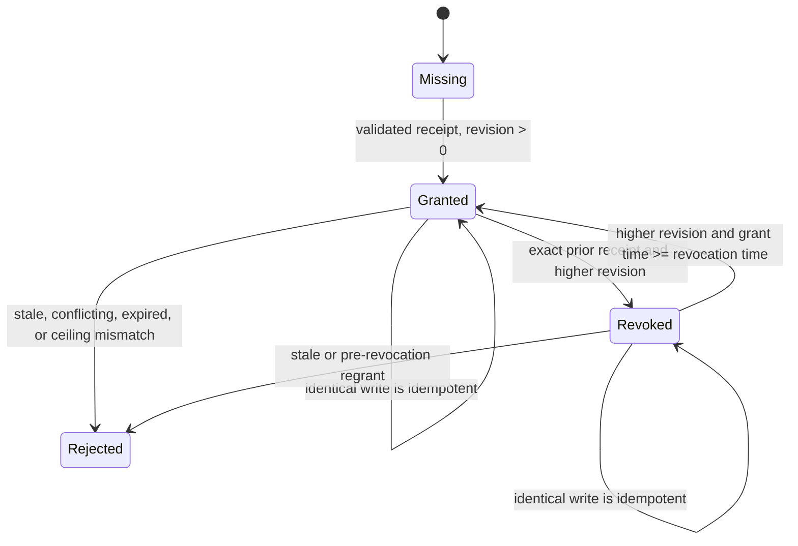

# A3S Use Plugin Lifecycle and Security

- Status: accepted M0 contract baseline; runtime implementation in progress
- Planning baseline: 2026-07-30
- Product amendment: first-class OKF knowledge contribution accepted; M0K-A
  bundle contract frozen 2026-07-31, M0K-B control plane frozen 2026-08-01,
  M0K-C-A adapter/store foundation frozen 2026-08-02, and package-level
  six-surface saga, P0 package/capability hosts, and cognitive-package
  dependency/lock foundation frozen 2026-08-03; unified A3S Flow semantics
  plus A3S Code TUI/Web host/catalog integration frozen 2026-08-04,
  bounded exact-generation package/Runtime N/N+1 storage, and the Grant-aware
  graph saga foundation frozen 2026-08-05
- Architecture: [Plugin Platform Architecture](plugin-platform-architecture.md)
- Contracts: [Plugin Contract Reference](plugin-contracts.md)
- Roadmap: [A3S Use Plugin Platform Roadmap](../ROADMAP.md)

This document is the operational companion to the plugin platform
architecture. It defines lifecycle consistency, failure recovery, security,
storage, public application contracts, and observability.

The checked-in M0/M0K contracts cover Tool, MCP, OKF, Flow, Skill, and UI. The shared
OKF bundle inspector, schema-v3 parser, package validator, exact host evidence,
reconciler gate, injected Knowledge port, evidence-checking client, and
persistent generation store are implemented. The production A3S Knowledge
index backend remains target behavior. A package-level checkpoint journal and
typed OKF lifecycle adapter now implement the in-crate stage/promote/hide/remove
foundation. P0 package/capability hosts add generation-bound commit,
publish/hide, lease drain, and exact removal. A3S Code composes the supported
Tool Task, stdio MCP, A3S Flow, Skill, and UI host set; production Knowledge,
Runtime Service, Gateway/HTTP MCP, umbrella/managed-host Grant-authority
forwarding, and managed-host composition remain pending. Standalone Grant
planning/apply is implemented. Without promoted observation, an OKF surface
stays unpublished.

The dependency foundation adds canonical schema-v3 SemVer edges, a bounded
deterministic transitive resolver, exact Registry/TUF-bound package locks,
dependency-forward download and preparation, exact retained-node verification,
single-snapshot graph publication, reverse uninstall, and crash-safe partial
receipt recovery. Signed remote schema-v3 `install`/`uninstall` and compatible
remote `component` commands call this graph coordinator. Code TUI/Web inject
their supported host set through the public lifecycle factory and consume one
exact-generation watcher; management MCP and managed-host mutations must still
reuse that composition.

Flow has one engine, `a3s-flow`. Use verifies its bounded source and explicit
Tool/MCP/OKF dependency edges; a typed host adapter owns Native TypeScript
preflight, durable execution, replay, and observation. `flow.json` remains a
design/deployment document for that same identity, never an independent
package or lifecycle mechanism.

## Complete End-to-End Lifecycle Flow

The following is the normative full lifecycle flow, from metadata-only search
through selective installation, active use, upgrade, disable, uninstall,
retained data, and crash recovery. The same Plugin Manager serves CLI, Web,
and management MCP adapters. Solid arrows are normal transitions. Dotted
arrows represent recovery after durable operation intent has been recorded.

```mermaid
flowchart TD
  actor["User or authorized agent"] --> command{"Requested operation"}

  subgraph discovery["1. Discovery and resolution"]
    catalog["Refresh and search verified metadata<br/>No package payload download"]
    inspect["Inspect provenance, surfaces, permissions,<br/>sizes, compatibility, and withdrawal state"]
    installChoice{"Install selected release?"}
    resolveInstall["Resolve exact package versions and dependency graph<br/>Freeze Registry/TUF-bound package lock<br/>Action: install"]
    resolveUpgrade["Resolve N+1, permission diff, dependencies,<br/>and provider requirements<br/>Action: upgrade"]
    resolveUninstall["Resolve owned resources, workspace impact,<br/>leases, and retained data<br/>Action: uninstall"]
    hostContext["Allocate operationId and host context<br/>Bind actor, scope, policy identity, lifetime,<br/>capability generation, and state revision"]
    executable{"Resulting package state contains<br/>Tool or Runtime-backed MCP surfaces?"}
    planningTarget["Fetch only signed catalog-v3 planning-v1.json<br/>Verify exact TUF name, length, SHA-256,<br/>package identity, and executable surface closure"]
    providerPreflight["Host Runtime broker preflight<br/>Use host-configured assignment and capabilities;<br/>package cannot select or register a provider"]
    providerCapable{"One explicit provider can enforce<br/>the required workload and permission profile?"}
    rejectPlanning["Reject as unplannable<br/>No archive download and no mutation"]
    grantProposal["Resolve canonical pre-confirmation grant proposal<br/>Bind operation, actor, scope, policy, package,<br/>permission ceiling, lifetime, and state revision"]
    runtimePlan["Build provider-neutral Runtime templates<br/>Bind the grant-proposal digest, then select again<br/>against the same provider/build/capability evidence"]
    buildPlan["Persist canonical expiring plan<br/>Bind package lock/digest, Registry/TUF evidence,<br/>scope, grant proposals, provider evidence, and impact"]
  end

  command -- "Search / inspect / install" --> catalog
  catalog --> inspect
  inspect --> installChoice
  installChoice -- "No" --> idle["No mutation"]
  installChoice -- "Yes" --> resolveInstall
  command -- "Upgrade" --> resolveUpgrade
  command -- "Uninstall" --> resolveUninstall
  resolveInstall --> hostContext
  resolveUpgrade --> hostContext
  resolveUninstall --> hostContext
  hostContext --> executable
  executable -- "No Runtime Tool/MCP planning target" --> buildPlan
  executable -- "Yes" --> planningTarget
  planningTarget --> providerPreflight
  providerPreflight --> providerCapable
  providerCapable -- "No" --> rejectPlanning
  rejectPlanning --> command
  providerCapable -- "Yes" --> grantProposal
  grantProposal --> runtimePlan
  runtimePlan --> buildPlan

  subgraph authorization["2. Authorization and immutable apply"]
    policy{"ACL policy decision"}
    confirmation{"User confirms the exact plan?"}
    confirmationEvidence["Persist confirmation evidence binding<br/>planDigest + each grant proposal digest"]
    denied["Denied or cancelled<br/>No mutation"]
    apply["Apply with operationId + canonical planDigest"]
    loadPlan["Load the immutable reviewed plan<br/>from the durable manager store"]
    resultExists{"Durable terminal result already exists?"}
    replayResult["Return the same result with replayed=true<br/>No child process or side effect"]
    reresolve["Repeat trust, dependency, permission,<br/>provider, ownership, and impact resolution"]
    exact{"Still exactly matches the plan?"}
    drift["Reject expired or changed plan<br/>Require a new review"]
    finalizeProposals["Deterministically finalize validated grant proposals<br/>No side effect or package-controlled input"]
    intent["Persist durable operation intent<br/>and per-surface idempotency keys"]
    plannedAction{"Planned action"}
  end

  buildPlan --> policy
  policy -- "deny" --> denied
  policy -- "ask" --> confirmation
  confirmation -- "No" --> denied
  confirmation -- "Yes" --> confirmationEvidence
  confirmationEvidence --> apply
  policy -- "allow within every ceiling" --> apply
  apply --> loadPlan
  loadPlan --> resultExists
  resultExists -- "Yes" --> replayResult
  replayResult --> command
  resultExists -- "No" --> reresolve
  reresolve --> exact
  exact -- "No" --> drift
  drift --> command
  exact -- "Yes" --> finalizeProposals
  finalizeProposals --> intent
  intent --> plannedAction

  subgraph packageInstall["3. Package installation or upgrade staging"]
    stage["Revalidate the complete lock before payload download<br/>then fetch dependencies before dependents<br/>to bounded staging roots"]
    verify["Verify TUF metadata, archive length/digest,<br/>manifest, paths, descriptors, artifacts,<br/>compatibility, and permission ceiling"]
    valid{"All verification gates pass?"}
    rejectPackage["Delete or quarantine staging data<br/>Record typed failure; preserve N on upgrade"]
    commit["Atomically commit immutable package generation<br/>and candidate installed-disabled receipt"]
    grantNeeded{"Planned exact-generation<br/>grant transition?"}
    persistCandidateGrant["Persist validated candidate grant receipt<br/>without replacing N authorization"]
    desiredAfterCommit{"Desired state after commit?"}
  end

  plannedAction -- "install / upgrade" --> stage
  stage --> verify
  verify --> valid
  valid -- "No" --> rejectPackage
  rejectPackage --> completeResult
  valid -- "Yes" --> commit
  commit --> grantNeeded
  grantNeeded -- "Yes" --> persistCandidateGrant
  grantNeeded -- "No" --> desiredAfterCommit
  persistCandidateGrant --> desiredAfterCommit

  subgraph reconcile["4. Surface reconciliation"]
    observe["Observe package, desired state, grants,<br/>bindings, projections, Runtime, and Gateway"]
    graph["Build required surface dependency closure<br/>All surfaces required unless explicitly optional"]
    provider{"Explicit provider still satisfies<br/>artifact, Task/Service, isolation, network,<br/>health, mount, resource, and secret capabilities?"}
    staticVerify["Verify Skill, UI, and OKF content<br/>and declared dependency references"]
    taskPrepare["For each CLI Tool:<br/>prepare exact-generation Runtime Task binding<br/>or constrained legacy native binding"]
    serviceApply["For each HTTP Tool:<br/>apply private Runtime Service<br/>and wait for declared health"]
    mcpTransport{"For each MCP surface"}
    mcpHttp["Streamable HTTP:<br/>apply Runtime Service, pass health,<br/>then complete standard MCP probe"]
    mcpStdio["stdio:<br/>prepare supervised bidirectional session<br/>and complete standard MCP probe"]
    closure{"Required dependency closure usable?"}
    previous{"Superseded generation N exists?"}
    previousState{"Was generation N active?"}
    keepPrevious["Keep generation N active<br/>Record N+1 failure and remediation"]
    keepPreviousDisabled["Keep generation N installed-disabled<br/>Record N+1 failure and remediation"]
    broken["Withhold or revoke required capabilities<br/>Keep package installed; observed broken"]
    readyBindings["Persist non-secret bindings<br/>and receipt-owned projections"]
    degradedBindings["Persist required bindings only<br/>Record optional-surface failures"]
    projectionReady{"Skill roots, command shims, UI/OKF indexes,<br/>and backend bindings committed?"}
    publishReady["Atomically publish one capability generation<br/>Then drain/remove any superseded generation"]
    publishDegraded["Atomically publish required capabilities<br/>Mark aggregate degraded; retry optional surfaces"]
  end

  desiredAfterCommit -- "installed-disabled" --> installedDisabled["Installed and disabled"]
  desiredAfterCommit -- "enabled" --> observe
  observe --> graph
  graph --> provider
  provider -- "No" --> previous
  provider -- "Yes" --> staticVerify
  provider -- "Yes" --> taskPrepare
  provider -- "Yes" --> serviceApply
  provider -- "Yes" --> mcpTransport
  mcpTransport -- "Streamable HTTP" --> mcpHttp
  mcpTransport -- "stdio" --> mcpStdio
  mcpTransport -- "none declared" --> closure
  staticVerify --> closure
  taskPrepare --> closure
  serviceApply --> closure
  mcpHttp --> closure
  mcpStdio --> closure
  closure -- "Required failure" --> previous
  previous -- "Yes" --> previousState
  previousState -- "Yes" --> keepPrevious
  previousState -- "No" --> keepPreviousDisabled
  previous -- "No" --> broken
  closure -- "All declared surfaces ready" --> readyBindings
  closure -- "Only optional surfaces failed" --> degradedBindings
  readyBindings --> projectionReady
  degradedBindings --> projectionReady
  projectionReady -- "No" --> previous
  projectionReady -- "Yes, complete" --> publishReady
  projectionReady -- "Yes, required only" --> publishDegraded
  publishReady --> ready["Enabled and ready"]
  publishDegraded --> degraded["Enabled and degraded"]

  subgraph use["5. Active use and observation"]
    watch["Session watches capability revision"]
    useRequest["Flow run, Skill/UI/OKF load,<br/>or Tool/MCP invocation"]
    visible{"Authorized exact-generation binding visible?"}
    rejectUse["Reject new use<br/>disabled, stale, incompatible, or unauthorized"]
    lease["Acquire exact-generation shared lease"]
    surfaceKind{"Surface kind"}
    runTask["CLI Tool:<br/>run one Runtime Task with native argv,<br/>bounded input/output, and exit status"]
    callService["HTTP Tool:<br/>call private Service through scoped Gateway binding"]
    callMcp["MCP:<br/>use standard MCP client and declared transport"]
    runFlow["A3S Flow:<br/>run exact-generation durable workflow<br/>through the injected host adapter"]
    loadStatic["Skill/UI/OKF:<br/>load verified generation-scoped projection"]
    release["Release lease and record bounded observation"]
    changed{"Health or provider observation changed?"}
  end

  ready --> watch
  degraded --> watch
  keepPrevious --> watch
  command -- "Use installed capability" --> useRequest
  watch --> useRequest
  useRequest --> visible
  visible -- "No" --> rejectUse
  rejectUse --> command
  visible -- "Yes" --> lease
  lease --> surfaceKind
  surfaceKind -- "CLI Tool" --> runTask
  surfaceKind -- "HTTP Tool" --> callService
  surfaceKind -- "MCP" --> callMcp
  surfaceKind -- "Flow" --> runFlow
  surfaceKind -- "Skill / UI / OKF" --> loadStatic
  runTask --> release
  callService --> release
  callMcp --> release
  runFlow --> release
  loadStatic --> release
  release --> changed
  changed -- "No" --> command
  changed -- "Yes" --> observe

  subgraph toggle["6. Enable and disable"]
    togglePolicy{"Authorize enable or disable<br/>allow / ask / deny"}
    toggleConfirm{"User confirms?"}
    toggleIntent["Persist durable toggle intent<br/>and idempotency key"]
    toggleAction{"Enable or disable?"}
    setEnabled["Persist desired enabled"]
    setDisabled["Persist desired installed-disabled"]
  end

  command -- "Enable / disable" --> togglePolicy
  togglePolicy -- "deny" --> denied
  togglePolicy -- "ask" --> toggleConfirm
  toggleConfirm -- "No" --> denied
  toggleConfirm -- "Yes" --> toggleIntent
  togglePolicy -- "allow" --> toggleIntent
  toggleIntent --> toggleAction
  toggleAction -- "Enable" --> setEnabled
  setEnabled --> observe
  toggleAction -- "Disable" --> setDisabled

  subgraph remove["7. Disable, uninstall, and retained data"]
    referenceGate{"New protected workspace reference<br/>not covered by reviewed plan?"}
    setAbsent["Persist desired absent"]
    revokeGrant["Persist exact-generation grant tombstone<br/>when a current grant exists"]
    hide["Atomically hide routes and projections<br/>Block new calls"]
    drain["Drain exact-generation leases<br/>or reach reviewed timeout policy"]
    removalAction{"Desired state"}
    stop["Stop eager Tool/MCP/Flow workloads<br/>Keep immutable package and data"]
    removeRuntime["Stop and remove Runtime units,<br/>Gateway routes, and endpoint bindings"]
    removeProjection["Remove receipt-owned Skill roots,<br/>command shims, UI/OKF indexes, and bindings"]
    removePackage["Remove scope receipt and unreferenced<br/>immutable package generations"]
    retain["Retain plugin data and secret records by default"]
    removed["Absent / removed"]
    purge{"Separate explicit user-only purge?"}
    purgeData["Delete reviewed plugin data and secret records"]
  end

  plannedAction -- "uninstall" --> referenceGate
  referenceGate -- "Yes" --> drift
  referenceGate -- "No" --> setAbsent
  setAbsent --> revokeGrant
  revokeGrant --> hide
  setDisabled --> hide
  hide --> drain
  drain --> removalAction
  removalAction -- "installed-disabled" --> stop
  stop --> installedDisabled
  removalAction -- "absent" --> removeRuntime
  removeRuntime --> removeProjection
  removeProjection --> removePackage
  removePackage --> retain
  retain --> removed
  removed --> purge
  purge -- "No" --> completeResult
  purge -- "Yes, explicitly reviewed" --> purgeData
  purgeData --> completeResult

  subgraph completion["8. Durable completion and replay"]
    completeResult["Persist append-only terminal result<br/>Bind operationId, planDigest, timestamps,<br/>typed outcome, and capability before/after"]
    returnResult["Return operation result<br/>A repeated apply reuses this record"]
  end

  installedDisabled --> completeResult
  ready --> completeResult
  degraded --> completeResult
  keepPrevious --> completeResult
  keepPreviousDisabled --> completeResult
  broken --> completeResult
  completeResult --> returnResult
  returnResult --> command
  idle --> command
  denied --> command

  subgraph recovery["9. Crash recovery and reconciliation"]
    restart["Restart finds incomplete operation"]
    compare["Compare durable intent with package, receipt, grant,<br/>Runtime, Gateway, binding, projection, and lease observations"]
    recoveryCase{"Last durable evidence"}
    cleanStage["Delete bounded staging data<br/>Re-plan if necessary"]
    repairReceipt["Reconstruct or quarantine receipt<br/>from verified immutable package"]
    repairBinding["Inspect exact Runtime unit<br/>Reconstruct binding without adopting unknown units"]
    continueRemoval["Continue route drain, stop, removal,<br/>or generation garbage collection"]
  end

  intent -. "Crash or process restart after durable intent" .-> restart
  toggleIntent -. "Crash or process restart" .-> restart
  setEnabled -. "Restart reconciles desired state" .-> restart
  setDisabled -. "Restart reconciles desired state" .-> restart
  setAbsent -. "Restart reconciles desired state" .-> restart
  restart --> compare
  compare --> recoveryCase
  recoveryCase -- "staging only" --> cleanStage
  cleanStage --> command
  recoveryCase -- "package committed" --> repairReceipt
  repairReceipt --> observe
  recoveryCase -- "Runtime applied / binding missing" --> repairBinding
  repairBinding --> observe
  recoveryCase -- "routes hidden / old generation leased" --> continueRemoval
  continueRemoval --> drain

  classDef stable fill:#e8f5e9,stroke:#2e7d32,color:#1b5e20;
  classDef failure fill:#ffebee,stroke:#c62828,color:#7f0000;
  classDef durable fill:#e3f2fd,stroke:#1565c0,color:#0d47a1;
  classDef runtime fill:#fff8e1,stroke:#f9a825,color:#5d4037;
  class ready,degraded,installedDisabled,removed,keepPrevious,keepPreviousDisabled stable;
  class denied,drift,rejectPlanning,rejectPackage,rejectUse,broken failure;
  class hostContext,planningTarget,grantProposal,buildPlan,confirmationEvidence,intent,toggleIntent,commit,persistCandidateGrant,revokeGrant,publishReady,publishDegraded,setEnabled,setDisabled,setAbsent,completeResult,returnResult,replayResult durable;
  class providerPreflight,providerCapable,runtimePlan,taskPrepare,serviceApply,mcpHttp,mcpStdio,runTask,callService,runFlow,removeRuntime runtime;
```

The graph has nine important invariants:

- search and inspection never download a package archive;
- an executable plan downloads only the small, separately signed planning
  target before review;
- provider choice is host input and is rechecked without fallback;
- a repeated `operationId + planDigest` returns the durable result without
  starting another child process or side effect;
- package installation commits a disabled receipt before any capability is
  published;
- a required Flow is unpublished until its Tool/MCP/OKF closure is usable, and
  a required Skill is invisible until its Flow or direct dependency closure is usable;
- a stored grant alone never publishes a capability;
- upgrade switches all required N+1 bindings in one capability generation or
  keeps N active; and
- disable or uninstall hides new routes before waiting for existing leases.

### Flow readiness and cutover

A Flow is an executable orchestration surface but owns no ambient authority.
Its package source is admitted only after bounded UTF-8 and digest validation.
The typed `a3s-flow` host then preflights the exact engine, runtime adapter,
source, export, package version, and generation. Tool, MCP, and OKF dependencies
must already be ready. Only matching host observation may publish the Flow and
its dependent Skill/UI surfaces.

Disable hides the complete package generation before stopping new Flow starts.
Uninstall removes Flow host state before removing its dependencies or package
root. Durable run history follows explicit host retention policy and is not
silently deleted as package content.

### OKF readiness and cutover

An OKF surface follows the static-content branch but has a distinct A3S
Knowledge observation. It is not a Runtime Task or Service and it does not gain
authority from concept text or YAML frontmatter.

M0K-B freezes the machine evidence used by this flow:
`a3s.use.okf-projection-receipt.v1` records the staged candidate,
`a3s.use.okf-knowledge-observation.v1` records staged/promoted/failed/removed
state and last-good selection, and `a3s.use.okf-capability-projection.v1`
contains only exact promoted evidence. M0K-C-A persists their combined
`a3s.use.okf-knowledge-binding.v1` record and reconstructs selection only from
retained exact promoted evidence. The production Knowledge index backend and
scope-aware capability/session caller remain pending. The package lifecycle
adapter already performs stage-store-promote-store, reuses a retained promoted
generation after restart, hides without deleting on disable, and delegates
only the exact receipt to Knowledge on uninstall.

Before publication, the candidate exact generation must provide evidence for:

1. its manifest-local surface ID, Open Knowledge Format version, package and
   expanded-bundle digests, file/concept counts, and configured limits;
2. valid UTF-8 Markdown, properly delimited frontmatter, one non-empty scalar
   `type` per non-reserved concept, canonical in-root paths, reserved index/log
   handling, bounded standard Markdown links, and preserved extension fields;
3. an idempotent A3S Knowledge staging result bound to package, scope, surface,
   generation, bundle digest, and index schema/build identity;
4. atomic promotion of that exact staged index plus a non-secret observation
   digest; and
5. any same-generation consumer dependencies required by Skill or other host
   projections.

The capability snapshot selects the new OKF generation only after promotion.
If conformance, staging, or indexing fails, the candidate is `broken` or
`degraded` according to required closure and the last good searchable
generation remains selected. Crash replay uses the parent operation ID and OKF
surface idempotency key; it must neither duplicate an index nor infer success
from a staging directory.

The binding store uses a SHA-256 scope directory, validated publisher/package
and OKF surface segments, fixed-width generation filenames, bounded regular
JSON files, atomic replacement, and a cross-process lock. Observation updates
are monotonic. Failed or staged N+1 may keep exact promoted N selected;
promoted N+1 switches selection; and removed N+1 cannot fall back to N. The
store retains at most 32 generations and requires explicit receipt-owned
cleanup instead of deleting evidence automatically.

Disable hides the OKF capability from new sessions without deleting personal
knowledge. Uninstall removes only the package receipt-owned projection and
index generation after references are checked. Raw compiler sources, personal
notes, retained plugin data, and another package's OKF index are outside that
receipt and remain untouched.

## Lifecycle and Consistency

Package storage, Runtime providers, Gateway, and Code/Web cannot participate in
one ACID transaction. Lifecycle therefore uses a durable, idempotent saga with
an operation record and compensating actions.

The durability boundary has three non-overlapping layers:

- the shared Plugin Manager stores immutable reviewed plans, apply intent, and
  terminal results keyed by `operationId`; it owns expiry, replay, adapter
  equivalence, and capability generation/revision evidence;
- the umbrella component lifecycle owns cross-component download and component
  mutation checkpoints; and
- the A3S Use package journal owns the canonical package/surface sequence and
  non-secret checkpoint evidence, while the package, grant, Runtime, Gateway,
  Skill/UI, and Knowledge stores retain detailed resource receipts.

For dependency-bearing operations, the reviewed package lock is the immutable
package-graph sequence. Each changed package keeps its existing surface journal;
the graph coordinator invokes those journals in topological order and owns the
single closure publication boundary. Retained packages have no new lifecycle
unit or side effect.

The manager record never duplicates per-surface checkpoints. After a crash, it
re-enters the exact umbrella apply command, which resumes the matching A3S Use
intent. That intent validates every completed receipt and executes only its
next deterministic checkpoint. This separation keeps one package journal as
the sequencing source of truth while each typed host remains the ownership
source of truth for its resources.

The implemented package checkpoint schedules are:

| Action | Canonical order |
| --- | --- |
| Install | commit installed-disabled package → prepare surfaces in dependency order → publish one capability generation |
| Upgrade candidate | retain exact N → commit N+1 disabled → prepare candidate surfaces → publish the changed closure once → retire replaced N in reverse order; a pre-cutover failure automatically removes candidates and restores N, with durable rollback/retirement replay |
| Enable | prepare surfaces in dependency order → publish one capability generation |
| Disable | hide package capability → drain accepted calls → stop surfaces in reverse dependency order |
| Uninstall | hide package capability → drain accepted calls → remove receipt-owned surfaces in reverse dependency order → remove package |

Tool, MCP, OKF, Flow, Skill, and UI are contributions inside this sequence. No
surface receives an independent install or uninstall record.

The package-graph schedules are:

| Action | Canonical order |
| --- | --- |
| Install | revalidate all locked metadata → download dependencies forward → commit/prepare changed packages forward → verify retained nodes → publish changed closure once |
| Upgrade | negotiate host capabilities v3 → revalidate plan-v3 prior/candidate locks → classify Add/Replace/Remove/Retain → download and prepare only changed N+1 forward → publish candidates and removed routes once → on pre-cutover failure restore N, otherwise hide/drain/remove replaced and unreferenced N in reverse prior-lock order |
| Uninstall | hide/drain each changed package in reverse lock order → remove dependent before dependency → preserve every Retain node |

Every retained node must still match the lock's version, catalog, package and
manifest digests, Registry/TUF provenance, host compatibility, enabled receipt,
and current published snapshot. Receipt state alone is not visibility evidence.
The immutable Registry snapshot is the graph commit point, so a crash after
writing only some enabled receipts leaves the new graph invisible until exact
replay publishes the complete closure. Before a removed selected receipt leaves
the primary store, it is copied to its content-bound retained-generation path;
the cutover then removes its route atomically, and reverse retirement can hide,
drain, and delete that exact generation without allowing a later snapshot to
reintroduce it.

The package store persists lifecycle-managed state as receipt schema v3. The
receipt and derived route binding carry the exact positive lifecycle
generation; the deterministic immutable root also binds that generation and
package digest. Commit is installed-disabled, publish and hide replace one
complete route snapshot, accepted calls hold shared leases, and drain obtains
the exclusive lease before exact removal. Legacy v1/v2 receipts remain
readable and mutable through their existing flow, while legacy toggles reject
schema-v3 ownership.

### Install and enable

1. Resolve verified metadata and SemVer constraints into an exact package lock.
2. Snapshot active grant evidence, derive the sorted root/dependency change
   set, and bind both digests into the canonical expiring plan.
3. Re-resolve on apply and persist an operation intent before side effects.
4. Revalidate every locked Registry/TUF/catalog input before any payload
   download, then download and verify dependencies before dependents.
5. Atomically commit each changed immutable package and a disabled receipt in
   dependency order; exact published `Retain` generations are reused.
6. Persist any planned exact-generation grant without replacing another
   package generation's authorization.
7. Record desired `enabled` state and reconcile Tool, MCP, OKF, Flow, Skill, and UI
   bindings in dependency order.
8. Wait for mandatory Services and MCP probes; prepare lazy Tasks.
9. Atomically publish all changed packages in one capability generation.
10. Mark the operation complete and garbage-collect safe staging data.

If activation fails, the package remains installed but disabled or broken with
typed diagnostics. No partial command shim, endpoint, MCP route, OKF generation,
Flow, Skill, or UI is advertised as ready.

### Upgrade

Generation N remains active while N+1 is staged and reconciled. Services use a
health-gated blue/green binding. After N+1 is fully ready, one atomic snapshot
switch routes new work to N+1. Generation N drains, stops, and is collected
only after all leases release. N and N+1 grants use separate digest-keyed
records during this interval. A failed N+1 leaves N active and revokes the
candidate Grant unless the durable operation remains resumable. The Grant-aware
graph path persists N+1 authorization before package preparation, checkpoints
the exact Registry snapshot transition, drains calls admitted by N, and only
then revokes N. A pre-cutover publication failure restores both package and
Grant candidates.

An added permission, secret request, provider requirement, external
dependency, command alias, or public interface is plan drift and requires a
new grant or confirmation.

### Disable and uninstall

Disable first publishes a snapshot without the plugin, then drains invocations
and stops eager workloads. The immutable package and retained data remain.

Uninstall:

1. records desired `absent`;
2. persists the Grant operation intent and exact prior retirement evidence;
3. atomically removes new-call routes and session projections;
4. checkpoints the exact capability cutover;
5. drains exact-generation leases held by accepted prior calls;
6. persists exact-generation Grant tombstones;
7. stops and removes Runtime units, Gateway bindings, receipt-owned shims,
   projections, receipts, and unreferenced package generations; and
8. retains plugin data and secrets unless a separate purge is authorized.

For a cascade graph uninstall, these steps run in reverse topological order.
A package cannot be removed before its installed dependents, and shared
dependencies selected as `Retain` remain installed and published.

Global uninstall is rejected while another protected workspace grant depends
on the release unless the reviewed plan includes that impact.

### Crash recovery

On startup, the reconciler scans incomplete operations and compares durable
intent with package, receipt, grant, Runtime, Gateway, and projection
observations.

| Last durable point | Recovery |
| --- | --- |
| Download only | Delete bounded staging data and retry |
| Package committed, receipt absent | Reconstruct or quarantine from verified manifest |
| Disabled receipt committed | Resume reconciliation without publishing |
| Candidate grant committed, bindings absent | Revalidate the exact plan and resume or tombstone the candidate |
| Runtime unit applied, binding absent | Inspect exact unit and reconstruct binding |
| Binding ready, snapshot absent | Revalidate grants and publish atomically |
| Some graph receipts enabled, closure snapshot absent | Keep the partial receipts invisible and replay the exact lock-bound batch publication |
| Closure published, package journals incomplete | Re-publish the exact idempotent lock batch, complete each journal, then commit graph metadata |
| Root receipt and installed-root graph removed, uninstall pending | Recover the exact lock, manifests, generations, and admission from pending evidence and continue reverse removal |
| Desired absent, cutover committed, Grant still active | Drain accepted prior calls, persist the planned exact-generation tombstone, then continue cleanup |
| Snapshot removed, workload running | Continue drain and stop |
| Old generation still referenced | Preserve it and retry garbage collection |

Every external mutation carries an idempotency key derived from operation,
surface, and generation. Recovery never guesses that an unknown provider unit
belongs to the plugin.

The A3S Use journal stores bounded canonical JSON under a SHA-256 scope path and
validated package segments. Writes use a cross-process lock, atomic replacement,
file and parent sync, symlink rejection, strict schemas, and monotonic
checkpoint times. Replaying a completed checkpoint with different outcome or
evidence is a conflict. Runtime preparation and cleanup evidence is derived
from stable reviewed plan identity rather than volatile observation timestamps,
so same-key concurrent replay converges.

## Security Architecture

The integrity chain is:

```text
trusted registry root
  -> signed catalog target metadata
  -> verified catalog-v3 planning target name, length, and digest
  -> typed executable planning bundle
  -> package archive digest
  -> manifest and surface content digests
  -> release descriptor digest
  -> signed permission ceiling
  -> active workspace grant snapshot
  -> canonical workspace grant proposal
  -> host-selected provider/build/capability evidence
  -> Runtime template semantics digest
  -> sorted multi-package grant change set
  -> immutable operation plan digest
  -> user confirmation digest for ask decisions
  -> finalized workspace grant digest
  -> exact-generation workspace grant receipt
  -> executable or image artifact digest
  -> binding receipt
  -> capability snapshot generation
```

Breaking any link fails closed.

### Permission model

Permissions are typed ceilings evaluated per package digest, surface,
workspace, and actor:

- filesystem read/write roots;
- network egress domains and private inbound Service exposure;
- child-process and native execution;
- secret names, never secret values;
- CPU, memory, process, storage, execution-time, and output limits;
- UI backend binding and method/path ceilings where configured; and
- user-only destructive operations.

Skill instructions, OKF concepts, Tool output, MCP descriptions, OpenAPI text,
UI messages, and catalog descriptions are untrusted content. They cannot
create a grant, change provider selection, add a dependency, or authorize
lifecycle mutation. OKF Attested Computation metadata cannot implicitly invoke
an executor or attester.

Secrets are delivered by reference at invocation or Service start. They are
excluded from manifests, descriptors, plans, receipts, binding snapshots,
logs, diagnostics, and UI state.

The initial grant contract is
`a3s.use.plugin-workspace-grant.v1`. It binds the workspace and immutable
package generation to both the signed ceiling and the canonical resolved
permission digest, plus policy/actor/confirmation evidence and optional
expiry. Subset evaluation is structural: filesystem and UI paths may only
narrow, network hosts stay exact, ports/methods/secrets may only be removed,
resource values may only decrease, and boolean authorities cannot change from
false to true. Secret-bearing grants require an explicit user confirmation;
agent grants containing secrets are invalid.

Before persistence, `a3s.use.plugin-workspace-grant-proposal.v1` binds the
operation, exact package generation, resolved permission subset, policy
decision, and review window without claiming confirmation. An `allow` proposal
finalizes at trusted apply time. An `ask` proposal requires a
`a3s.use.plugin-grant-confirmation.v1` record created at the user boundary that
binds the operation ID, immutable plan digest, proposal digest, user actor, and
confirmation time. Finalization rejects plan/proposal substitution, future
evidence, and expired review windows. This two-phase ordering avoids a circular
digest between a pre-confirmation plan and a final grant containing
confirmation evidence.

Before-state uses
`a3s.use.plugin-workspace-grant-snapshot.v1`: sorted active evidence binds
package ID/digest, receipt revision, grant digest, scope, and global state
revision. The corresponding
`a3s.use.plugin-workspace-grant-changes.v1` record contains sorted per-package
before evidence and/or after proposals. Its validator derives the exact package
keys and sides required by the plan's Add, Replace, and Remove transitions,
including dependencies. `grantBeforeDigest` binds the snapshot and
`grantAfterDigest` binds the change set.

Every `ask` apply also carries
`a3s.use.plugin-operation-confirmation.v1`, including revoke-only uninstall
where no new proposal exists. Proposal confirmations must share its plan and
confirmation time. Resolution emits candidate grants for preparation and
exact-current evidence for delayed retirement; persistence ordering remains a
durable saga checkpoint around capability cutover.

The before snapshot is read under the durable grant-store lock. Traversal is
bounded and validates the hashed scope root plus every publisher, package, and
generation path. Both receipts and revocation tombstones participate in stale
state-revision detection. Only granted receipts become active evidence, sorted
uniquely by package ID. If both N and N+1 remain granted after an interrupted
operation, planning stops with an unstable-snapshot error until the saga
recovers; it never guesses which generation capability publication selected.
Abandoned atomic-write temporary files are ignored because they were never
activated.

The grant sub-saga persists
`a3s.use.plugin-workspace-grant-operation.v1` before its first side effect. Its
immutable intent contains the exact resolved operation identity, planned and
observed before state, candidate receipts and signed ceilings, prior receipts,
and next state/capability generations. Phase replacements and grant records use
the same store lock and atomic-file discipline:

1. `intent-recorded` exists before candidate writes;
2. `preparing` is durable while candidate writes replay;
3. `prepared` guarantees every candidate record is exact and active;
4. `cutover-committed` contains
   `a3s.use.plugin-workspace-grant-cutover.v1` generation and snapshot evidence;
5. `retiring` replays exact old-generation tombstones; and
6. `completed` means all grant-side effects converged.

Before cutover, failure may branch from the first three phases to
`rolling-back` and then `rolled-back`. The rollback record binds
`a3s.use.plugin-workspace-grant-rollback.v1` evidence and restores the exact
prior Grant/tombstone at every candidate path, or removes only the candidate
when that path did not previously exist. Rollback after cutover is rejected.

Cutover evidence cannot be from the future or bind another capability
generation. Candidate drift blocks cutover. Retirement without cutover is
rejected. A same-generation permission replacement is verified as the new
receipt and is not subsequently tombstoned. The Grant-aware graph coordinator
places candidate persistence before package/Runtime readiness, exact Registry
publication before the cutover checkpoint, accepted-call drain before Grant
retirement, and provider/package cleanup afterward. Standalone and umbrella
Plugin Managers must still derive the canonical inputs after policy and
confirmation and select this path when Grants are required.

Durable authorization uses two storage schemas:
`a3s.use.plugin-workspace-grant-receipt.v1` for a revisioned active decision
and `a3s.use.plugin-workspace-grant-revocation.v1` for a tombstone that binds
the exact prior revision and grant digest. Records live at
`<state-root>/grants/<scope-sha256>/<publisher>/<package>/<package-sha256>.json`.
They are bounded, atomically replaced under a cross-process lock, protected by
real-directory and regular-file checks, and never deleted during ordinary
revocation.

Each immutable package digest has an independent record. N therefore remains
authorized while an N+1 candidate is prepared, but only the generation in the
atomic capability snapshot is visible to new calls. After snapshot cutover and
lease drain, the N record transitions to a tombstone. A failed or abandoned
candidate is likewise revoked unless its durable operation remains resumable.



`observe` returns durable evidence only. Invocation and reconciliation must use
the active resolver so the exact scope, package ID and digest, current signed
ceiling, permission subset, and clock are checked again. Missing and revoked
records return no authority; malformed or moved records fail closed.

### Agent authority

The management MCP exposes bounded search, inspect, status, plan, and apply
operations over the same Plugin Manager used by CLI and Web. Default mutation
policy is `ask`. Trust-root changes, unsigned/local install, secret grants, and
data purge remain user-only.

The M4 implementation stops at bounded search, inspect, installed-state reads,
and immutable install/upgrade/uninstall plan creation. Apply and toggle tools
are not published until M6; the Use worker additionally denies those names if
they are ever attached accidentally. The only currently supported management
scope is `user/current`, and callers cannot provide a registry URL, local path,
executable, endpoint, secret reference, or selective surface set.

Using a Tool is separate from managing a plugin. The agent can invoke only a
Tool binding already projected into its authorized session. It cannot supply a
provider, executable path, endpoint, package root, or secret reference.

## Storage and Projection

The target logical layout is:

```text
data/use/
  plugins/                 immutable canonical generations
  state/
    receipts/              installed ownership and desired state
    operations/            durable lifecycle saga records
    bindings/              non-secret Runtime and host bindings
    grants/                workspace permission decisions
  projections/
    <host>/<scope>/         generated Skills, command shims, UI/OKF indexes
  plugin-data/             retained mutable plugin data
  cache/                   evictable metadata and artifact cache
  staging/                 bounded incomplete operations
```

Package payload is user-wide and deduplicated by digest. Grants, enablement,
bindings, and projections are scope-specific. Mutable plugin data is never
stored under an immutable package generation.

Runtime units and endpoint bindings are workspace-scoped in the initial
contract, even when two workspaces use the same package bytes. Cross-workspace
process or Service sharing would combine permission and data boundaries and is
therefore a separate future design, not an implicit optimization.

The workspace grant store is rooted at
`<state-root>/grants/<scope-sha256>/<publisher>/<package>/`. The final filename
is the lowercase package SHA-256, so simultaneous N and N+1 records cannot
overwrite one another. Within an exact generation, only a higher revision with
a non-regressing authorization time may replace current state. Revocation
requires the exact current receipt and persists a tombstone; a moved,
conflicting, stale, malformed, oversized, symlinked, or non-regular record
fails closed.

The Runtime binding store is rooted at
`<state-root>/bindings/runtime/<scope-sha256>/<publisher>/<package>/<surface>/`
with one fixed-width generation receipt per file. It never uses a
caller-provided scope, package, surface, or generation as an unchecked path.
The cross-process-locked store retains at most 32 exact generations, validates
every directory entry, fails closed on moved, malformed, oversized, symlinked,
or non-regular receipts, and removes only the exact receipt presented by its
owner. N and N+1 therefore coexist during preparation. Within one Service
generation, only a newer observation with unchanged immutable binding evidence
may refresh the receipt.

Live observation also binds the Service receipt to the Runtime process start
time. A restart within the same unit generation marks the old endpoint receipt
stale, forcing Gateway rebinding and a new MCP initialize probe. During
uninstall, the saga revokes the Gateway route first, calls the explicit
provider to stop and remove the exact Runtime unit/generation, then removes the
exact-current binding receipt. Provider build drift blocks new apply but does
not redirect or silently prevent cleanup of an already-owned unit.

Runtime-to-reconciler observation is also scope- and generation-explicit. The
observer accepts the workspace identity, canonical package digest, and exact
package generation, reads only matching receipt-owned surfaces, and resolves
only their recorded providers. Release-backed Tool Tasks, Tool Services, and
Streamable HTTP MCP are merged with disjoint compatibility-host and UI
observations. An absent receipt stays pending; a stale binding cannot publish
its dependency closure. A process-wide caller without a workspace identity
and exact generation must not choose a `current` or default binding.

The current `data/use/extensions/` layout migrates in place through versioned
receipts or remains a compatibility path. A migration must not duplicate large
payloads merely to rename a directory.

## Public Application Contracts

All adapters call one application service:

```text
search(query, filters, page)
inspect(plugin_id, version?)
list_installed(scope)
status(plugin_id, scope)
plan_install | plan_upgrade | plan_uninstall
apply(operation_id, plan_digest, authority_context)
enable | disable
watch(after_revision)
```

Tool execution is a separate data-plane contract:

```text
resolve_binding(plugin_id, tool_id, scope, generation?)
invoke_task(binding, argv, input_reference?)
resolve_service(binding)
```

The implementation accepts only installed binding IDs. This contract is not
published as a general plugin action RPC and does not replace native CLI or
HTTP semantics.

## Observability

Every lifecycle operation has an operation ID, actor, scope, plan digest,
package digest, provider evidence, start/end time, and typed outcome. Events
follow the repository convention:

```text
use.plugin.install.planned
use.plugin.install.completed
use.plugin.surface.reconciling
use.plugin.surface.ready
use.plugin.surface.failed
use.plugin.capability.published
use.plugin.uninstall.completed
```

Status separates desired state, aggregate observed state, each surface state,
last transition, retryability, and remediation. Logs are fetched through the
owning Runtime provider and are bounded and redacted.
