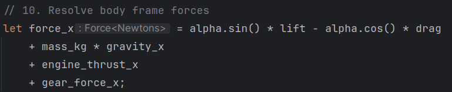

# absolute_unit

A unit system for Rust's type system to catch unit errors in your physical calculations.

## Usage

Add absolute_unit to your Cargo.toml:
```toml
absolute_unit = "0.11" # or latest version
```

Import the prelude to get access to everything, or import ala carte, if you know what you need.
```rust
use absolute_unit::prelude::*;
```

## Examples

Use the type system to ensure that you get the expected units out of a calculation.
```rust
let time = seconds!(10);
let velocity = meters_per_second!(100);
let position: Length<Meters> = velocity * time;
assert_eq!(position, meters!(1000));
```

Use IDE type introspection to discover the type of a result.


Let the type system convert the units for you.
```rust
let result = meters!(1) + feet!(3.28084);
assert_relative_eq!(result, meters!(2), epsilon = 0.00001);
```

Check type correctness even when using approximation formulas that contain intermediate values with no inherent
unit-based meaning. Runtime checks only happen in `#[cfg(debug_assertions)]`, so there is no runtime cost in
release builds.
```rust
let drag: Force<Newtons> = (coef_drag.as_dyn()
            * air_density.as_dyn()
            * (velocity_cg * velocity_cg).as_dyn()
            * meters2!(1_f64).as_dyn())
        .into();
```

## Technical Details

The unit wrappers store the underlying value as f64 and provide the same derivations (plus Ord/PartialOrd) as the
underlying f64, enabling straightforward usage in most situations. All the type info compiles away, leaving identical
performance to bare f64.

## One-way Doors

This library makes a number of choices that may not be suitable for everyone's requirements.

### 64bit Floats

The underlying types are 64bit. My application required this precision and muddying all the interfaces with a second
generic for the float size would have made using these types significantly uglier. In pretty much every CPU-bound
situation, 64bit floats are going to have the same or better performance than 32bit floats, with the exception that
you have enough of them to cause memory bandwidth issues. In that case you should be storing them in an array to use 
SIMD and have unit protection at a higher level. Such a tool is left as an exercise to the reader, with the note that
conversion into and out of these types is free once you have an f64 in a register.

### Non-NaN/Inf -> Ord, PartialOrd, and Hash

Real-world values should never, ever be NaN or Inf. Such values almost always reflect a serious defect in
either the underlying calculations or input data. As such, these unit types panic on construction with a NaN
or Inf. This allows us to implement Ord and PartialOrd, making absolute_unit values generally easier to deal with
than a raw f64.