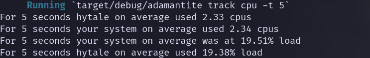
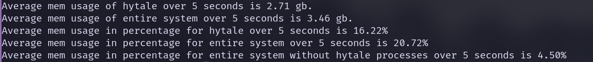
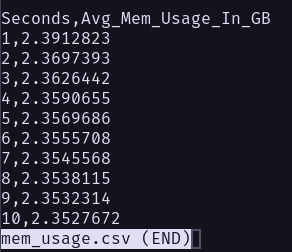

# Adamantite
Adamantite is a current work in progress.

# What it will do
Adamantite is currently a command line tool similar to htop and top. It will provide a digestable overlook on how much system resources is being consumed by Hytale and its processes.

# Why?
My reasoning for building this tool is because I wanted to learn rust. But also I host my own hytale server and at one point my server was lagging and attempting to use htop to figure out why was difficult.So I thought I wish there was a way that I could get a high level overview on how Hytale and its processes are performing on your system.

# Usage Currently
If you are interested in cloning this repo and attempting to run this program I'll go over this now.

## Installation methods
There is binary realeses for linux, you can clone this repo, or run 
```bash
cargo install adamantite
```
If you clone this repo you can do the following

```
$ cargo run -- [COMMAND]
```
```
Usage: adamantite [COMMAND]

Commands:
  track     Tracks a system resource
  pressure  Shows how often system work is stalled due to resource contention
  help      Print this message or the help of the given subcommand(s)

Options:
  -h, --help     Print help
  -V, --version  Print version
```

```
cargo run -- track --help

Tracks a system resource

Usage: adamantite track [OPTIONS] <SYSTEM_RESOURCE>

Arguments:
  <SYSTEM_RESOURCE>
          Possible values:
          - cpu: System resource cpu
          - mem: System resource memory

Options:
  -t, --time-seconds <TIME_SECONDS>
          [default: 1]

  -o, --output <OUTPUT>
          Possible values:
          - csv:  Output type of CSV
          - none: Default output type is None

          [default: none]

  -h, --help
          Print help (see a summary with '-h')
```
```
cargo run -- live --help
```
```
Shows Live Hytale vs System metrics

Usage: adamantite live [OPTIONS]

Options:
  -i, --interval-ms <INTERVAL_MS>  Interval update time in ms [default: 500]
  -h, --help                       Print help
[kev@shadow adamantite]$
```
There are two system resources that you can monitor for x seconds:
- cpu
- mem

These are cpu, memory.


As of now, running the command where x is seconds
```
cargo run -- track cpu -t x 
```
Output example:



This command will return to you the average number of cores being used by hytale. Adamantite will also provide the average cpu cores your system is using so you have a refrence on how hytale is performing compared to the rest of your system.

This command will lastly provide the average cpu load your entire system experineced over x seconds.

Example command:
```
$ cargo run -- track mem -t 5
```
Output would look like this 


This command will provide the average memory usage in gigabytes over x seconds. It will also provide the average memory usage in gigabytes as well for the entire system over x seconds.

For the rest of the output, adamantite will provide average memory usage as a percentage for hytale, your entire system including hytale, and your entire system excluding hytale as well.

Example command:
```
$ cargo run -- track mem -t 10 -o csv
```
This command will write to a file with either the name mem_usage.csv or cpu_usage.csv based on the resource that is currently being tracked.

An example of the file contents are this


```
cargo run -- pressure --help
```

```

Shows how often system work is stalled due to resource contention

Usage: adamantite pressure <PRESSURE_TYPE>

Arguments:
  <PRESSURE_TYPE>  The resource to inspect [possible values: io, mem]

Options:
  -h, --help  Print help (see more with '--help')
```
You can view the past pressure for two types: io and mem. Memory pressure is time stalled because memory could not be allocated or reclaimed fast enough. I/O pressure is time spent waiting on disk or storage operations to complete.

Example command :
```
$ cargo run -- live
```

This command will bring up a TUI where you can see live updates of your system memory and cpu usage as well as hytale's memory and cpu usage.

Output:


### Why is pressure important
Pressure directly reflects time the server could not advance its game loop, making it a strong indicator of tick instability and perceived lag.

## Currently investigating feature to add
Currently looking into providing disk metrics that should be useful in determining perfomance drops for you server
## What is being worked and plans for future

Maybe might be possible to use previous runs of commands and compare them with other runs. Say you ran the adamantite to track hytale's memory usage over 5 seconds while the system was idle. Now say you want to compare that when you have three people in your server. I was thinking you provide two outputs from the command and compare them.Might be cool to see how hytale performance differs.

Say we track 5 seconds of cpu usage from Hytale and its processes. We need to follow Hytale's logs that it produces at that same time.

There are two possible routes and probably more to do this but these are what came to my mind first.

We can go the concurrency route where we instantiate two threads, one thread to get Hytales cpu usage and another thread to parse Hytale logs.

If not concurrency, I looked into using journalctl. So once we get the cpu usage for those 5 seconds we just pass arguments to journalctl to show me Hytale's logs for the last 5 seconds and parse it from there

### AI ?
Currently no AI generated code.
