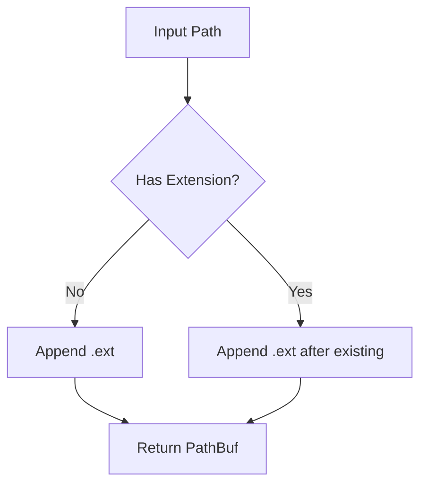

[English](#en) | [中文](#zh)

---

<a id="en"></a>

# add_ext : Append extensions to file paths

## Table of Contents

- [Project Overview](#project-overview)
- [Usage](#usage)
- [Features](#features)
- [Design](#design)
- [Tech Stack](#tech-stack)
- [Directory Structure](#directory-structure)
- [API Reference](#api-reference)
- [Historical Context](#historical-context)

## Project Overview

`add_ext` provides utilities for appending extensions to file paths. When a path already has an extension, the new extension is appended after the existing one, preserving the original extension.

## Usage

```rust
use std::path::PathBuf;
use add_ext::add_ext;

// Path without extension
let path = PathBuf::from("test");
assert_eq!(add_ext(&path, "tmp"), PathBuf::from("test.tmp"));

// Path with extension
let path = PathBuf::from("test.json");
assert_eq!(add_ext(&path, "tmp"), PathBuf::from("test.json.tmp"));

// Nested path
let path = PathBuf::from("dir/subdir/file.txt");
assert_eq!(add_ext(&path, "bak"), PathBuf::from("dir/subdir/file.txt.bak"));

// Empty extension
let path = PathBuf::from("file");
assert_eq!(add_ext(&path, ""), PathBuf::from("file."));

// Multiple dots
let path = PathBuf::from("archive.tar.gz");
assert_eq!(add_ext(&path, "tmp"), PathBuf::from("archive.tar.gz.tmp"));
```

## Features

- Preserve existing extensions by appending new ones
- Support for nested directory structures
- Handle paths with multiple dots correctly
- Accept empty extensions
- Zero dependencies for core functionality

## Design



The `add_ext` function accepts any type that can be converted into `PathBuf` and any type that can be referenced as `OsStr`. The implementation directly manipulates the underlying `OsString` by pushing a dot and the extension, ensuring original extensions are preserved.

## Tech Stack

- **Language**: Rust (Edition 2024)
- **Core Dependencies**: None
- **Dev Dependencies**: aok, log, log_init, static_init, tokio

## Directory Structure

```
add_ext/
├── Cargo.toml
├── Cargo.lock
├── src/
│   └── lib.rs
├── tests/
│   └── main.rs
└── readme/
    ├── en.md
    └── zh.md
```

## API Reference

### `add_ext`

```rust
pub fn add_ext(path: impl Into<PathBuf>, ext: impl AsRef<OsStr>) -> PathBuf
```

Appends an extension to a path while preserving existing extensions.

**Parameters:**
- `path`: Target path to extend
- `ext`: Extension to add (without leading dot)

**Returns:**
- `PathBuf`: Extended path

**Examples:**

```rust
use add_ext::add_ext;

add_ext("test", "tmp");        // -> "test.tmp"
add_ext("file.json", "bak");   // -> "file.json.bak"
add_ext("archive.tar.gz", "tmp"); // -> "archive.tar.gz.tmp"
add_ext("file", "");           // -> "file."
```

## Historical Context

File extensions have been used since the early days of computing to indicate file types. The concept originated with CP/M (Control Program for Microcomputers), created by Gary Kildall of Digital Research Inc. in the mid-1970s. Kildall, often called "the father of the personal computer operating system," designed CP/M with an 8.3 filename format (8 characters for the name, 3 for the extension), where the dot separated the filename from its type identifier. This design later influenced MS-DOS, which Microsoft developed for IBM's first personal computer in 1981.

The practice of appending multiple extensions (e.g., `.tar.gz`) emerged from Unix's modular design philosophy. The `tar` (tape archive) utility, developed in the early 1970s at AT&T Bell Laboratories, was designed to bundle multiple files into a single archive but did not include compression. When compression utilities like `gzip` (created in 1992 by Jean-loup Gailly) became popular, users would first create a `.tar` archive, then compress it with `gzip`, resulting in `.tar.gz`. This two-step process was a historical artifact—modern formats like ZIP and RAR combine archiving and compression in a single operation. The double extension convention persists today as a testament to Unix's "do one thing well" philosophy, where each tool performs a specific task and can be chained together using pipes.

This library follows that tradition, allowing developers to chain extensions for purposes like temporary files, backups, or versioned outputs, while preserving the original extension information.

---

## About

This project is an open-source component of [js0.site ⋅ Refactoring the Internet Plan](https://js0.site).

We are redefining the development paradigm of the Internet in a componentized way. Welcome to follow us:

* [Google Group](https://groups.google.com/g/js0-site)
* [js0site.bsky.social](https://bsky.app/profile/js0site.bsky.social)

---

<a id="zh"></a>

# add_ext : 为文件路径追加扩展名

## 目录

- [项目概述](#项目概述)
- [使用示例](#使用示例)
- [特性](#特性)
- [设计思路](#设计思路)
- [技术栈](#技术栈)
- [目录结构](#目录结构)
- [API 说明](#api-说明)
- [历史背景](#历史背景)

## 项目概述

`add_ext` 提供为文件路径追加扩展名的工具。当路径已有扩展名时，新扩展名会追加在现有扩展名之后，保留原始扩展名。

## 使用示例

```rust
use std::path::PathBuf;
use add_ext::add_ext;

// 无扩展名路径
let path = PathBuf::from("test");
assert_eq!(add_ext(&path, "tmp"), PathBuf::from("test.tmp"));

// 有扩展名路径
let path = PathBuf::from("test.json");
assert_eq!(add_ext(&path, "tmp"), PathBuf::from("test.json.tmp"));

// 嵌套路径
let path = PathBuf::from("dir/subdir/file.txt");
assert_eq!(add_ext(&path, "bak"), PathBuf::from("dir/subdir/file.txt.bak"));

// 空扩展名
let path = PathBuf::from("file");
assert_eq!(add_ext(&path, ""), PathBuf::from("file."));

// 多点路径
let path = PathBuf::from("archive.tar.gz");
assert_eq!(add_ext(&path, "tmp"), PathBuf::from("archive.tar.gz.tmp"));
```

## 特性

- 追加扩展名时保留现有扩展名
- 支持嵌套目录结构
- 正确处理包含多个点的路径
- 接受空扩展名
- 核心功能零依赖

## 设计思路


`add_ext` 函数接受任何可转换为 `PathBuf` 的类型和任何可引用为 `OsStr` 的类型。实现通过直接操作底层 `OsString`，推入点号和扩展名，确保原始扩展名被保留。

## 技术栈

- **语言**: Rust (Edition 2024)
- **核心依赖**: 无
- **开发依赖**: aok, log, log_init, static_init, tokio

## 目录结构

```
add_ext/
├── Cargo.toml
├── Cargo.lock
├── src/
│   └── lib.rs
├── tests/
│   └── main.rs
└── readme/
    ├── en.md
    └── zh.md
```

## API 说明

### `add_ext`

```rust
pub fn add_ext(path: impl Into<PathBuf>, ext: impl AsRef<OsStr>) -> PathBuf
```

为路径追加扩展名，同时保留现有扩展名。

**参数:**
- `path`: 要扩展的目标路径
- `ext`: 要添加的扩展名（不含前导点）

**返回:**
- `PathBuf`: 扩展后的路径

**示例:**

```rust
use add_ext::add_ext;

add_ext("test", "tmp");           // -> "test.tmp"
add_ext("file.json", "bak");      // -> "file.json.bak"
add_ext("archive.tar.gz", "tmp"); // -> "archive.tar.gz.tmp"
add_ext("file", "");              // -> "file."
```

## 历史背景

文件扩展名自计算早期就开始用于标识文件类型。这一概念起源于 CP/M（Control Program for Microcomputers，微型计算机控制程序），由 Digital Research 公司的 Gary Kildall 在 1970 年代中期创建。Kildall 常被称为"个人计算机操作系统之父"，他设计的 CP/M 采用 8.3 文件名格式（8 个字符用于文件名，3 个用于扩展名），其中点号将文件名与类型标识符分隔开。这一设计后来影响了 MS-DOS，微软在 1981 年为 IBM 的第一台个人计算机开发了 MS-DOS。

追加多个扩展名（如 `.tar.gz`）的做法源于 Unix 的模块化设计哲学。`tar`（tape archive，磁带归档）工具由 AT&T 贝尔实验室在 1970 年代早期开发，旨在将多个文件打包成单个归档文件，但不包含压缩功能。当 `gzip` 等压缩工具（1992 年由 Jean-loup Gailly 创建）变得流行时，用户会先创建 `.tar` 归档文件，然后用 `gzip` 压缩，结果就是 `.tar.gz`。这个两步过程是历史遗留产物——现代格式如 ZIP 和 RAR 将归档和压缩合并为单个操作。双扩展名约定延续至今，见证了 Unix 的"做一件事并做好"哲学，每个工具执行特定任务，可以通过管道链式组合使用。

本库遵循这一传统，允许开发者为临时文件、备份或版本化输出等目的链式添加扩展名，同时保留原始扩展名信息。

---

## 关于

本项目为 [js0.site ⋅ 重构互联网计划](https://js0.site) 的开源组件。

我们正在以组件化的方式重新定义互联网的开发范式，欢迎关注：

* [谷歌邮件列表](https://groups.google.com/g/js0-site)
* [js0site.bsky.social](https://bsky.app/profile/js0site.bsky.social)
