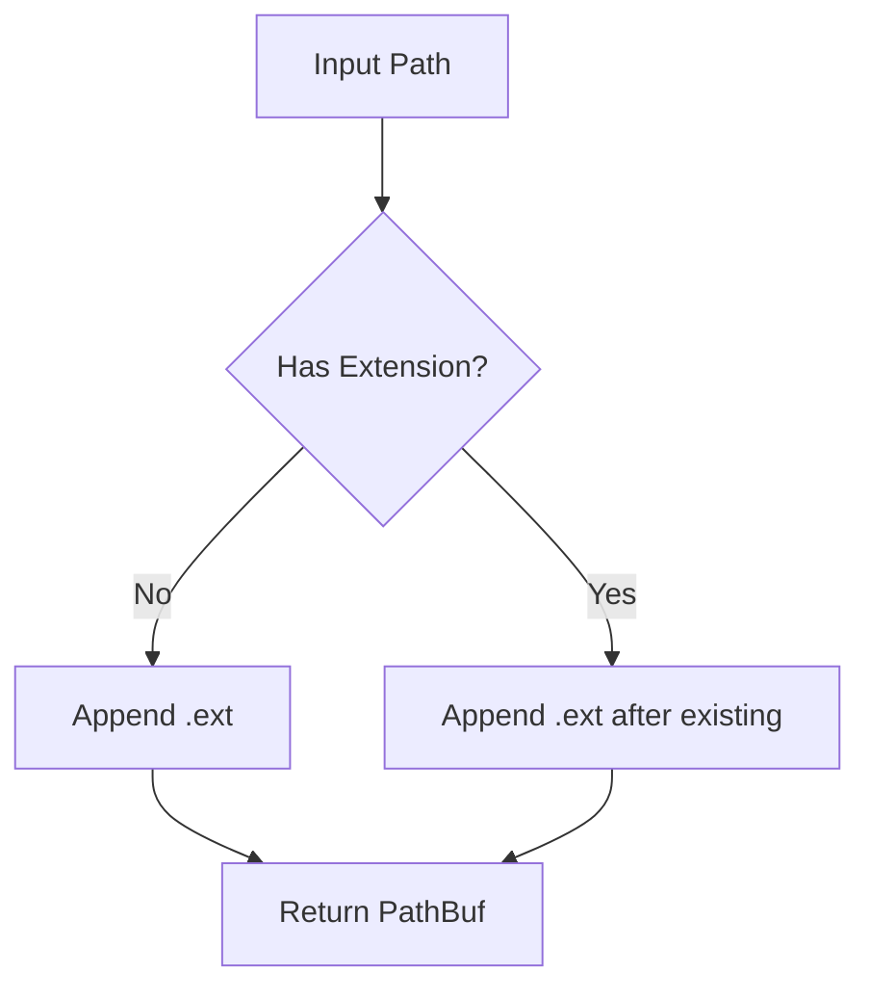

# add_ext : Append extensions to file paths

## Table of Contents

- [Project Overview](#project-overview)
- [Usage](#usage)
- [Features](#features)
- [Design](#design)
- [Tech Stack](#tech-stack)
- [Directory Structure](#directory-structure)
- [API Reference](#api-reference)
- [Historical Context](#historical-context)

## Project Overview

`add_ext` provides utilities for appending extensions to file paths. When a path already has an extension, the new extension is appended after the existing one, preserving the original extension.

## Usage

**Note:** Unlike the standard library's `Path::with_extension()` which *replaces* the existing extension, `add_ext` *appends* the new extension while preserving the original one.

```rust
use std::path::PathBuf;
use add_ext::add_ext;

// Standard library behavior (replaces extension)
PathBuf::from("test.json").with_extension("tmp"); // -> "test.tmp"

// add_ext behavior (appends extension)
add_ext("test.json", "tmp");                      // -> "test.json.tmp"

// Path without extension
let path = PathBuf::from("test");
assert_eq!(add_ext(&path, "tmp"), PathBuf::from("test.tmp"));

// Path with extension
let path = PathBuf::from("test.json");
assert_eq!(add_ext(&path, "tmp"), PathBuf::from("test.json.tmp"));

// Nested path
let path = PathBuf::from("dir/subdir/file.txt");
assert_eq!(add_ext(&path, "bak"), PathBuf::from("dir/subdir/file.txt.bak"));

// Empty extension
let path = PathBuf::from("file");
assert_eq!(add_ext(&path, ""), PathBuf::from("file."));

// Multiple dots
let path = PathBuf::from("archive.tar.gz");
assert_eq!(add_ext(&path, "tmp"), PathBuf::from("archive.tar.gz.tmp"));
```

## Features

- Preserve existing extensions by appending new ones
- Support for nested directory structures
- Handle paths with multiple dots correctly
- Accept empty extensions
- Zero dependencies for core functionality

## Design



The `add_ext` function accepts any type that can be converted into `PathBuf` and any type that can be referenced as `OsStr`. The implementation directly manipulates the underlying `OsString` by pushing a dot and the extension, ensuring original extensions are preserved.

## Tech Stack

- **Language**: Rust (Edition 2024)
- **Core Dependencies**: None
- **Dev Dependencies**: aok, log, log_init, static_init, tokio

## Directory Structure

```
add_ext/
├── Cargo.toml
├── Cargo.lock
├── src/
│   └── lib.rs
├── tests/
│   └── main.rs
└── readme/
    ├── en.md
    └── zh.md
```

## API Reference

### `add_ext`

```rust
pub fn add_ext(path: impl Into<PathBuf>, ext: impl AsRef<OsStr>) -> PathBuf
```

Appends an extension to a path while preserving existing extensions.

**Parameters:**
- `path`: Target path to extend
- `ext`: Extension to add (without leading dot)

**Returns:**
- `PathBuf`: Extended path

**Examples:**

```rust
use add_ext::add_ext;

add_ext("test", "tmp");        // -> "test.tmp"
add_ext("file.json", "bak");   // -> "file.json.bak"
add_ext("archive.tar.gz", "tmp"); // -> "archive.tar.gz.tmp"
add_ext("file", "");           // -> "file."
```

## Historical Context

File extensions have been used since the early days of computing to indicate file types. The concept originated with CP/M (Control Program for Microcomputers), created by Gary Kildall of Digital Research Inc. in the mid-1970s. Kildall, often called "the father of the personal computer operating system," designed CP/M with an 8.3 filename format (8 characters for the name, 3 for the extension), where the dot separated the filename from its type identifier. This design later influenced MS-DOS, which Microsoft developed for IBM's first personal computer in 1981.

The practice of appending multiple extensions (e.g., `.tar.gz`) emerged from Unix's modular design philosophy. The `tar` (tape archive) utility, developed in the early 1970s at AT&T Bell Laboratories, was designed to bundle multiple files into a single archive but did not include compression. When compression utilities like `gzip` (created in 1992 by Jean-loup Gailly) became popular, users would first create a `.tar` archive, then compress it with `gzip`, resulting in `.tar.gz`. This two-step process was a historical artifact—modern formats like ZIP and RAR combine archiving and compression in a single operation. The double extension convention persists today as a testament to Unix's "do one thing well" philosophy, where each tool performs a specific task and can be chained together using pipes.

This library follows that tradition, allowing developers to chain extensions for purposes like temporary files, backups, or versioned outputs, while preserving the original extension information.