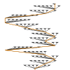
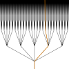
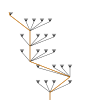

<!-- cargo-rdme start -->

Draw adic visualizations

#### 7-adic sqrt(2)




# Adic visualizations

- Adic clocks
- Adic trees

## Links
- [crates.io/adic-shape](<https://crates.io/crates/adic-shape>)
- [docs/adic-shape](https://docs.rs/adic-shape/latest/adic_shape/)
- [gitlab/adic](https://gitlab.com/pmodular/adic)
- [adicmath.com](https://adicmath.com) - our site, to learn about and play with adic numbers
- [crates.io/adic](<https://crates.io/crates/adic>) - crate for adic number math
- [wiki/P-adic_number](<https://en.wikipedia.org/wiki/P-adic_number>) - wikipedia for p-adic numbers


## Motivation

p-adic numbers are an alternate number system to the reals, containing the rationals.
Digitally, these numbers are a number expansion where there can be an infinite numbers
 to the LEFT of the decimal point instead of the right.
Assume for this documentation that `p=5`, i.e. the digits of the adic number are
 `0`, `1`, `2`, `3`, or `4`.

Examples:
- 0 = 0._5
- 1 = 1._5
- 2 = 2._5
- 5 = 10._5
- 25 = 100._5
- 53 = 203._5
- -1/4 = ...111._5
- 3/4 = ...112._5
- 7-adic 1st sqrt(2) = ...6623164112011266421216213._7
- 7-adic 2nd sqrt(2) = ...0043502554655400245450454._7


## Adic tree visualization

Given this digital expansion, you can construct a visualization in the form of a tree.
Imagine a tree growing from a root with five branches.
Each of the branches has five branches, and each of those has five, etc.
You can associate an adic number with an infinite path from the root of this tree to the top.
Each digit of the number is a choice at each branch point upward,
 from the "ones" place to the "fives" to the "twenty-fives" and so on.
E.g. the number `158 = ...00001113._5` has a choice of the "third" branch and then
 "one", "one", "one", and then zeros infinitely upward.



You can also plot a "zoomed-in" version that focuses just on the chosen branches.
This is usually better both for performance and ease of understanding.




## Adic clock visualization

Similarly, you can construct a visualization in the form of a clock.
Again, assume `p=5`.
Imagine an analog clock, but with two differences:
- There are `p=5` tick marks instead of `12` or `60`.
- There are an infinite number of hands,
  from the "seconds" hand to the "minute = 5s" hand to the "hour = 5m = 25s" hand, on and on.

For each digit from the "ones" place onward, set the corresponding hand to the corresponding tick mark.
It makes more sense as a "sweeping clock", e.g. if the ones place is `3` and the fives place is `1`,
 then set the first hand to the `3` tick and the second hand to `3/5` past the `1` tick mark.


## Crate

Currently this crate creates both SVG documents and Leptos components.
The display-independent code is in the `shape` directory and the `leptos` and `svg_doc`
 directories have the code for those displays.
The [`DisplayShape`] trait provides the interface between display-independent and display code.
We are oriented around a SVG display implementation, since both `leptos` and `svg` are html svg displays.

Adic numbers can be visualized with clocks ([`ClockShape`], [`ClockComponent`])
 and with trees ([`TreeShape`], [`TreeComponent`]).
Just create an adic integer with the `adic` crate, and create your desired [`DisplayShape`],
 either a [`ClockShape`] or [`TreeShape`].
If you want to print or save a raw SVG, use the [`SvgDocDisplay`] trait.
If you want to create a component for use in your `leptos` application,
 install this crate with the `leptos` feature flag
 and feed the shape into the corresponding [`ComponentDisplay`],
 either a [`ClockComponent`] or [`TreeComponent`].

Try the examples to see how to use the leptos components.
`cd` into the [`examples/leptos-clock`](https://gitlab.com/pmodular/adic/-/tree/develop/adic-shape/examples/leptos-clock)
 or [`examples/leptos-tree`](https://gitlab.com/pmodular/adic/-/tree/develop/adic-shape/examples/leptos-tree)
 directories and call `trunk serve`.

#### Save clock or tree SVG

```rust
let depth = 25;

// Draw clock SVG
let neg_158 = IAdic::from_i32(5, -158);
let shape_options = ClockShapeOptions::default();
let clock_shape = ClockShape::new(&neg_158, depth, shape_options)?;
let svg_doc = clock_shape.create_svg_doc();
svg::save("image.svg", &svg_doc)?;

// Draw zoomed tree SVG
let neg_one_fourth = radic!(5, [], [1]);
let shape_options = TreeShapeOptions {
    direction: Direction::Up,
    dangling_direction: Some(Direction::Down),
    ..Default::default()
};
let tree_shape = TreeShape::zoomed_tree(&neg_one_fourth, depth, shape_options)?;
let svg_doc = tree_shape.create_svg_doc();
svg::save("image.svg", &svg_doc)?;
```

#### Draw clock or tree leptos component

```rust
let depth = 6;

// Create clock view
let five_eighty_six = uadic!(5, [1, 2, 3, 4]);
let shape_options = ClockShapeOptions::default();
let clock_shape = ClockShape::new(&five_eighty_six, depth, shape_options)?;
let clock_view = view! {
    <ClockComponent class="clock" clock_shape=clock_shape/>
};

// Create tree view
let approx_7_adic_sqrt_2 = zadic_approx!(7, 6, [3, 1, 2, 6, 1, 2]);
let shape_options = ClockShapeOptions::default();
let shape_options = TreeShapeOptions {
    direction: Direction::Right,
    dangling_direction: Some(Direction::Down),
    ..Default::default()
};
let tree_shape = TreeShape::zoomed_tree(&approx_7_adic_sqrt_2, depth, shape_options)?;
let tree_view = view! {
    <TreeComponent class="tree" tree_shape=tree_shape/>
};
```

## Dependencies

### adic

The [`adic`](https://crates.io/crates/adic) crate handles the math of adic numbers.
The primary intention of the `adic-shape` crate is for visualizations of these numbers.
Combining the two crates is how to get the best out of `adic-shape`.

E.g. you can calculate the 7-adic +/- sqrt(2) with the `adic` crate:

```rust
let seven_adic_sqrt_2_variety = uadic!(7, [2]).nth_root(2, 6);
assert_eq!(Ok(zadic_variety!(7, 6, [
    [3, 1, 2, 6, 1, 2],
    [4, 5, 4, 0, 5, 4]
])), seven_adic_sqrt_2_variety);
```

Then you can plot these calculated numbers as above.

### svg

We use the [`svg`](https://crates.io/crates/svg) crate to create simple, self contained SVG of adic objects.
These can be transformed into text or files.

### leptos

Using the optional `leptos` feature, we export [`leptos`](https://leptos.dev/) components.

There are examples, `leptos-clock` and `leptos-tree`, showing off leptos clocks and trees.

## TODO

- Animations
- Interactive visualizations (drag the clock hands to change numbers)
- Visualizing adic functions
- Visualizing higher adic spaces, e.g. finite extensions and complex adic numbers

<!-- cargo-rdme end -->

License: MIT OR Apache-2.0
